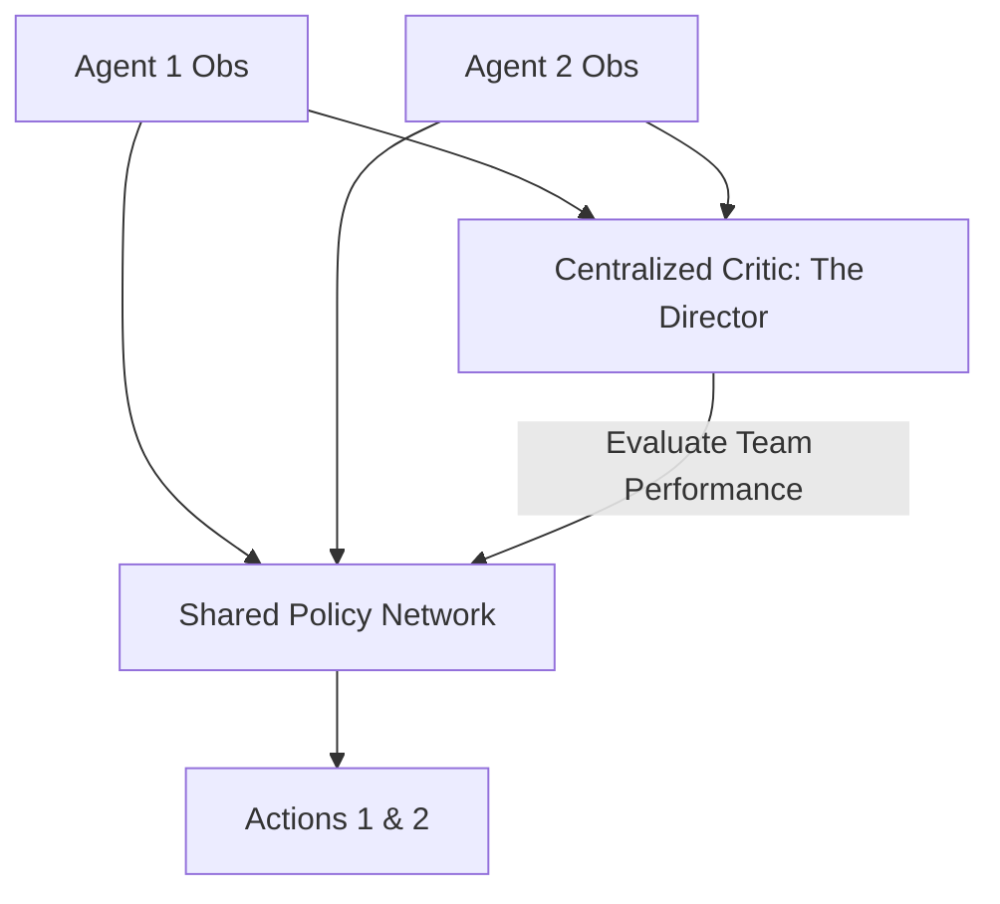

# MAPPO (Multi-Agent PPO)

🧠 **What does this do? (The Analogy)**
Think of a **Theater Production**. 
- Each actor (Agent) has their own script and only knows their own lines (Local State). 
- However, they all have a **Director** (Centralized Critic) who stands in the back of the room and sees the whole stage. 
- The Director doesn't tell the actors exactly what to do every second; instead, the Director gives them "Feedback" on how their individual performance contributed to the **Success of the Play**. 
**MAPPO** is the application of the stable PPO algorithm to this team-based environment.

🔍 **Step-by-Step Explanation:**
1. **PPO Stability**: It uses the same "Clipped Objective" as standard PPO, ensuring that agents don't make massive, dangerous changes to their behavior.
2. **Centralized Value Function**: The "Advantage" is calculated using a value function that sees the observations of every agent in the team.
3. **Parameter Sharing**: Often, all agents share the same "Brain" (Neural Network) but receive different inputs. This helps them learn 10x faster because they learn from each other's experiences.
4. **Benefit**: It is much more stable than MADDPG and often works better for complex team coordination (like a team of robots carrying a heavy object).

📊 **High-Level Design (HLD)**

✅ **Why use this?**
It is currently the **State-of-the-Art for Cooperative Games**. If you are building a team of AI for a game like Dota 2 or StarCraft II, or for a multi-robot warehouse, MAPPO is the most stable and reliable algorithm to use.

🌍 **Real-World Examples:**
1. **OpenAI Five**: The AI that beat the world champions at Dota 2 used a massive version of MAPPO.
2. **Collaborative Manufacturing**: 3 robot arms working together to weld a car chassis, where each arm must be perfectly synchronized with the others.
