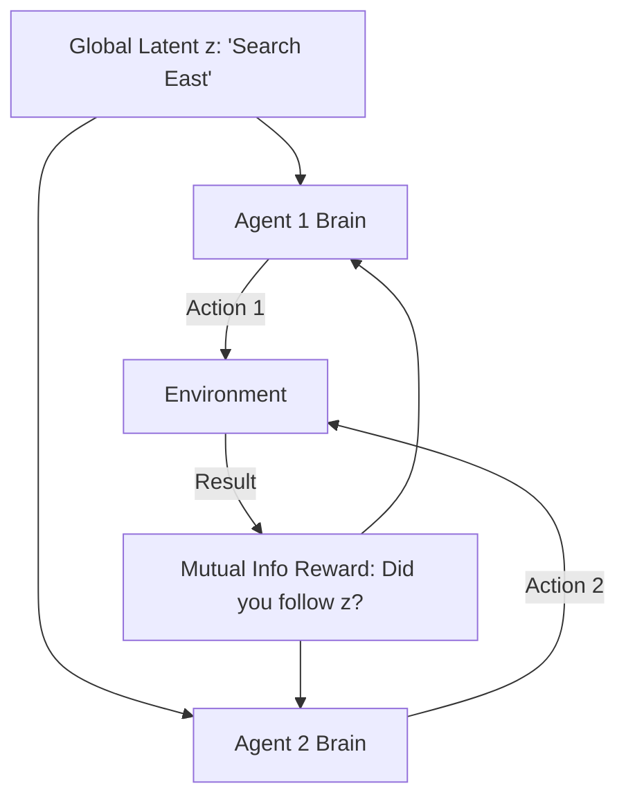

# MAVEN (Multi-Agent Variational Exploration)

🧠 **What does this do? (The Analogy)**
Think of a **Team of Treasure Hunters** in a giant cave. 
- **Standard RL Exploration**: Every hunter wanders randomly. They usually just stay near the entrance because they don't coordinate. 
- **MAVEN**: At the start of the day, the team leader picks a **Mission Card** (Latent Variable $z$). If the card says "North," **everyone** explores to the North together. If it says "Deep," they all go deep. 
By "syncing" their randomness, the team can explore much further into the cave than they could alone.

🔍 **Step-by-Step Explanation:**
1. **The Latent Variable $z$**: A random vector sampled once at the start of each episode.
2. **Coordinated Policy**: Every agent's neural network receives this $z$ as an input. It tells them the "Global Strategy" for this episode.
3. **Mutual Information**: The team is rewarded if they can "tell" which $z$ was picked just by looking at the final trajectory. This forces the agents to actually **follow** the mission card.
4. **Benefit**: It solves the "Stuck at Local Optima" problem in multi-agent games, where agents are too afraid to try new things because their teammates won't help them.

📊 **High-Level Design (HLD)**

✅ **Why use this?**
It is the best choice for **Hard-to-Explore Cooperative Tasks**. In games like "Overcooked" or complex factory simulations, MAVEN allows agents to find complex coordinated strategies (like "You chop, I cook") that they would never find through random wandering.

🌍 **Real-World Examples:**
1. **Robot Swarm Mapping**: 100 robots mapping a collapsed building. MAVEN ensures they don't all cluster in one room but instead spread out in "coordinated waves."
2. **Supply Chain Stress Testing**: Testing a global supply chain by "forcing" coordinated failures (e.g., "All ports in the West are closed") to see how the AI adapts.
