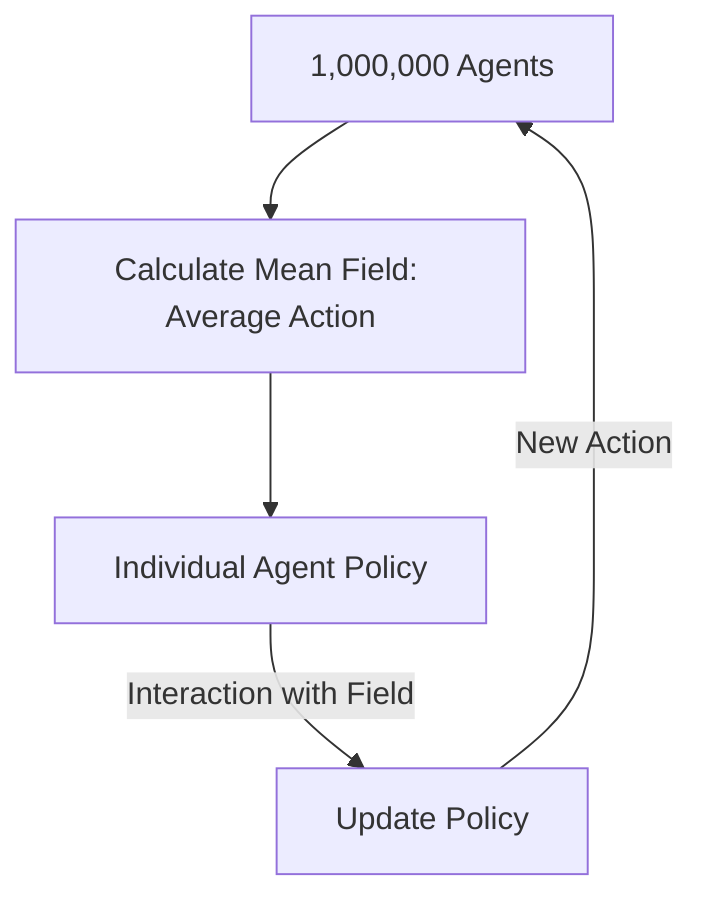

# Mean Field Multi-Agent RL

🧠 **What does this do? (The Analogy)**
Think of a **Bird in a massive flock**. The bird doesn't track the wing-beats of every other 10,000 birds. That would be impossible. Instead, the bird just feels the **"Flow" of the flock**. If the general "Mean Field" of the birds is moving left, the bird moves left. By only caring about the **Average Behavior** of its neighbors, a single bird can part of a massive, coordinated system without needing a supercomputer brain.

🔍 **Step-by-Step Explanation:**
1. **The Problem**: Standard Multi-Agent RL (MARL) breaks down when you have more than 10-20 agents because the complexity grows exponentially.
2. **Mean Field Approximation**: We assume all agents are somewhat similar. Instead of $Q(s, a_1, a_2, \dots, a_{1000})$, we learn $Q(s, a, \bar{a})$, where $\bar{a}$ is the **Mean Action** of all other agents.
3. **Local Interaction**: Each agent only cares about the "Average" of its immediate neighbors.
4. **The Benefit**: It scales to **thousands or millions** of agents. You can train one agent and deploy it into a crowd of any size.

📊 **High-Level Design (HLD)**

✅ **Why use this?**
It is the only way to solve tasks involving **Crowds**. Whether it's managing traffic in a city or simulated soldiers in a game, Mean Field RL provides a computationally efficient way to handle massive populations.

🌍 **Real-World Examples:**
1. **Ride-Hailing Optimization**: Coordinating 10,000 Uber/Lyft drivers in a city by treating the driver population as a "field" that moves toward high-demand areas.
2. **Financial Market Modeling**: Simulating how thousands of small traders react to a market shock, where each trader only sees the "Average Market Trend."
