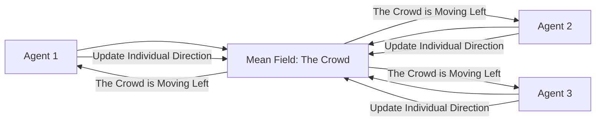

# Mean Field RL (Swarm Intelligence)

🧠 **What does this do? (The Analogy)**
Think of a **Swarm of 1,000,000 Locusts**. If one locust tries to keep track of where every other locust is moving, its brain will explode from too much data. Instead, the locust only looks at the **"Average" (Mean)** direction of the whole swarm. If the "Average" swarm is moving North, the locust moves North. **Mean Field RL** allows an AI to coordinate millions of agents by treating the crowd as a "Liquid" or a "Field" rather than individual units.

🔍 **Step-by-Step Explanation:**
1. **The Scaling Problem**: Multi-agent RL usually fails when you have more than 10-20 agents because there are too many interactions to calculate.
2. **Mean Approximation**: We assume that all agents are "similar" and that an agent only cares about the **Average Behavior** of its neighbors.
3. **Q-Value Blending**: $Q_i = f(s_i, a_i, \bar{a}_{-i})$, where $\bar{a}_{-i}$ is the mean action of all other agents.
4. **Benefit**: It can handle **infinite** agents. The math for 1,000 agents is the same as the math for 1,000,000,000.

📊 **High-Level Design (HLD)**

✅ **Why use this?**
It is the only way to solve **Massive Crowd Simulation** or **Financial Markets**. When you have millions of people buying and selling stocks, you don't model every person; you model the "Mean Field" of the market sentiment.

🌍 **Real-World Examples:**
1. **Traffic Flow Optimization**: Coordinating 10,000 self-driving cars in a city by treating them as a "Flow of Traffic."
2. **Nanobot Medicine**: Thousands of tiny medical robots in a human's bloodstream working together to find a tumor.
3. **Pest Control Simulation**: Predicting how a swarm of insects will move across a country to protect crops.
