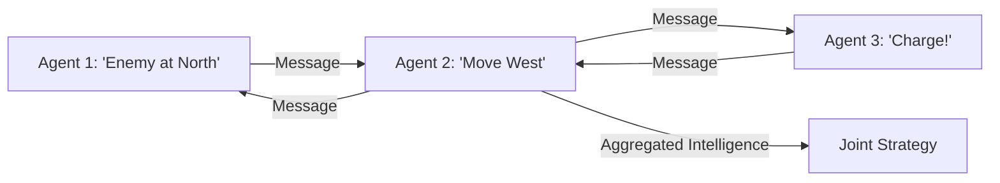

# Message Passing RL (Decentralized Communication)

🧠 **What does this do? (The Analogy)**
Think of a **Bucket Brigade putting out a fire**. 
- 10 people are standing in a line. 
- Person 1 doesn't see the fire; they only see the water and Person 2. 
- **Message Passing** is the signal they pass along: "Water's coming!" or "Faster!" 
- Each person only talks to the person next to them. 
By "Passing Messages," the whole line (The Graph) coordinates perfectly to put out the fire, even though no single person can see the whole situation.

🔍 **Step-by-Step Explanation:**
1. **Local View**: Each agent only sees its immediate environment and its neighbors.
2. **The Message**: A neural network converts the agent's hidden state into a "Small Vector" (The Message).
3. **Information Flow**: The message is sent to neighbors, who combine it with their own data and pass a new message forward.
4. **Benefit**: It is **Decentralized**. If you lose one agent in the middle, the rest of the network still functions.

📊 **High-Level Design (HLD)**

✅ **Why use this?**
It is the best choice for **Ad-Hoc Networks**. If you have a group of robots that need to work together but don't have a central "Tower" to talk to, Message Passing RL allows them to "Whisper" to each other to solve the task.

🌍 **Real-World Examples:**
1. **Satellite Constellation Management**: Satellites passing messages to each other to coordinate their orbits without waiting for commands from Earth.
2. **Blockchain Node Coordination**: Nodes in a peer-to-peer network passing messages to agree on the "State" of the blockchain.
