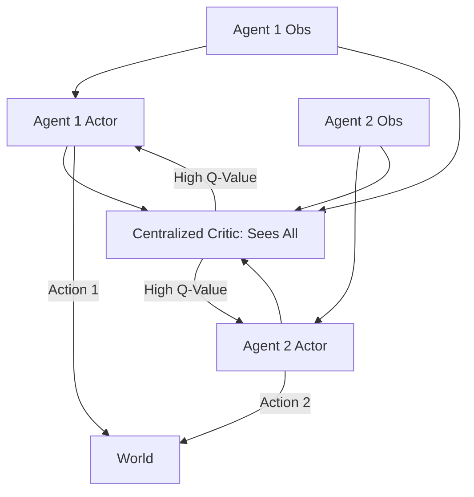

# Multi-Agent DDPG (MADDPG)

🧠 **What does this do? (The Analogy)**
Think of a **Soccer Team**. During practice (**Training**), the coach stands in the middle of the field and can see where every player is and what they are doing. This allows the coach to give perfect advice to each player. However, during the real game (**Execution**), the players are on their own. They can't see the coach's bird's-eye view; they only see what's in front of them. MADDPG uses that "Coach's View" to train players who are experts at working together without needing to see the whole field.

🔍 **Step-by-Step Explanation:**
1. **Centralized Critic**: For each agent, there is a critic that sees the observations and actions of **all** agents. This handles the problem of a "moving target" in multi-agent systems.
2. **Decentralized Actor**: Each agent's actor only takes its **own** observation as input.
3. **Continuous Action**: It uses the DDPG logic to handle continuous values (like steering or torque).
4. **Cooperation/Competition**: Because the critic sees everyone, it can reward agents for helping each other or for competing effectively.

📊 **High-Level Design (HLD)**

✅ **Why use this?**
It is the standard for **Cooperative Robotics**. If you have two robot arms trying to pick up a single heavy box, they need MADDPG to coordinate their torque and timing perfectly.

🌍 **Real-World Examples:**
1. **Satellite Constellations**: Coordinating 50 satellites to maintain their orbits and communicate with each other without crashing.
2. **Factory Automation**: Multiple mobile robots moving around a warehouse, learning to "give way" to each other to avoid traffic jams.
