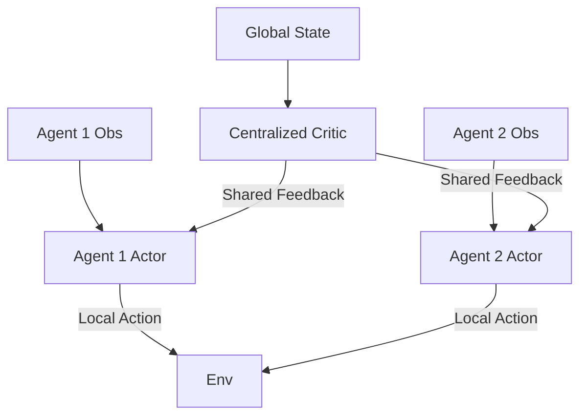

# Multi-Agent PPO (MAPPO)

🧠 **What does this do? (The Analogy)**
Think of a **Special Ops Team**. During practice (**Training**), everyone is in the same room, looking at a big satellite map of the whole area. They know where every teammate and every enemy is. However, during the real mission (**Execution**), they are out in the field. They can't see the big map anymore; they only see what is in front of them and hear their teammates on the radio. MAPPO trains agents to use that "Big Picture" knowledge during practice to make perfect "Local" decisions in the real world.

🔍 **Step-by-Step Explanation:**
1. **Centralized Training**:
   - The Critic network has access to the **global state** (info from all agents).
   - This makes the learning much more stable because it knows *why* an agent succeeded or failed.
2. **Decentralized Execution**:
   - The Actor networks only see their **local observations**.
   - During the mission, they don't need to know what everyone else is seeing to act correctly.
3. **PPO Logic**:
   - It uses the standard PPO clipping to ensure that the team's strategy doesn't change too drastically and collapse.

📊 **High-Level Design (HLD)**

✅ **Why use this?**
It is currently the **State-of-the-Art** for cooperative multi-agent tasks (like StarCraft II or coordinating a fleet of drones). It balances the power of centralized knowledge with the practicality of local action.

🌍 **Real-World Examples:**
1. **Drone Swarms**: Coordinating 100 drones to search an area, where each drone only sees its immediate surroundings but was trained to understand the swarm's overall mission.
2. **Traffic Network Optimization**: Each traffic light is an agent that only sees its own intersection, but they were trained together to maximize the flow across the entire city.
