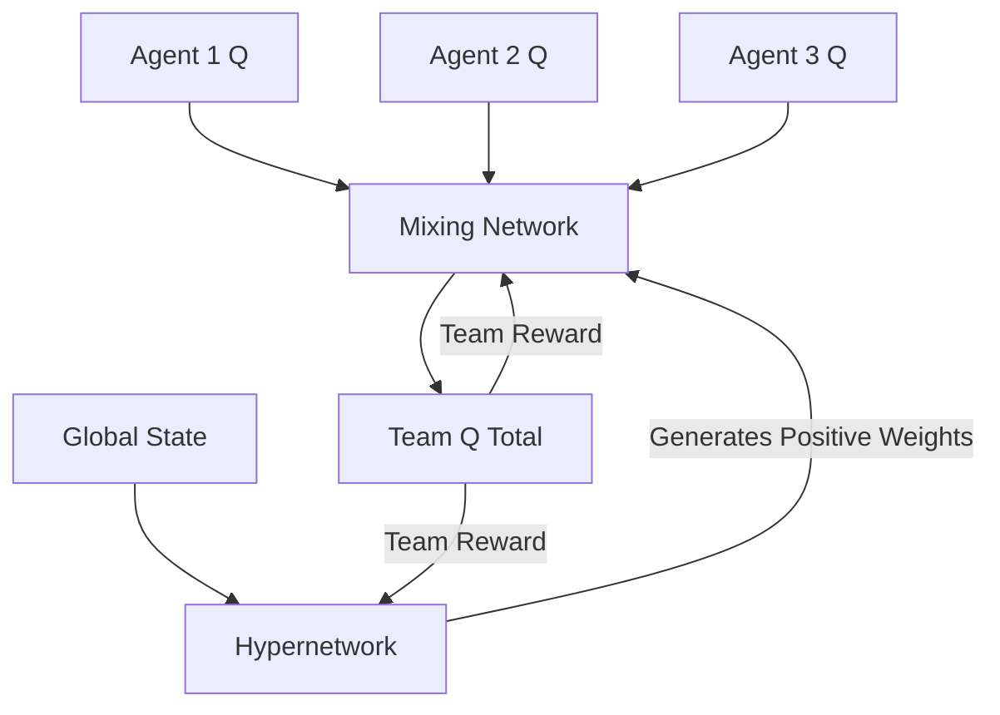

# QMIX (Monotonic Multi-Agent Coordination)

🧠 **What does this do? (The Big Picture)**
Think of a **Sports Team**. Every player has an individual score (Agent Q), but the only thing that matters is the **Team Score (Global Q)**. In standard systems, players might compete for the ball. **QMIX** uses a **Hypernetwork** to act as a "Monotonic Coach." It ensures that if *any* individual player improves their personal performance, the **Team Score is guaranteed to go up**. It creates a perfect coordination where the "Sum" is actually a complex, non-linear (but always positive) combination of all players.

🔍 **The Monotonicity Constraint:**

1.  **The Rule**: $\frac{\partial Q_{total}}{\partial Q_i} \geq 0$. This math ensures that the "Team Goal" and "Individual Goal" are perfectly aligned.
2.  **Hypernetworks**: Instead of using fixed weights to combine the player's scores, QMIX uses a second AI (The Hypernetwork) that looks at the **Overall Situation** (Global State) to decide how important each player is right now.
3.  **Positive Weights**: By forcing the mixer's weights to be absolute/positive, we mathematically guarantee that no player can help the team by "failing" on purpose.

📊 **High-Level Design (HLD)**

✅ **Why use this?**
QMIX is the **industry standard** for cooperative multi-agent tasks (like StarCraft II or warehouse robotics). It solves the "Credit Assignment" problem—deciding exactly which player was responsible for a team victory—in a way that is mathematically stable and scales to dozens of agents.

🌍 **Real-World Examples:**
1. **Fleet Logistics**: A team of 50 delivery drones where the "Global State" is the weather and traffic, and the "Hypernetwork" adjusts how much each drone's battery usage affects the team's total profit.
2. **Smart Grid Management**: Coordinating thousands of home batteries to stabilize a city's electricity. QMIX ensures that every battery's individual charging behavior contributes positively to the city's overall stability.
