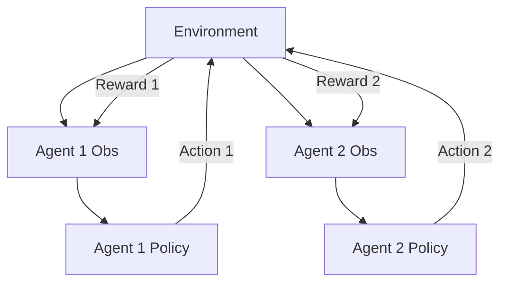

# Multi-Agent Reinforcement Learning (MARL)

## Introduction
MARL involves multiple agents interacting in a shared environment. It is significantly more complex than single-agent RL because the environment becomes **non-stationary** (the environment changes because other agents are learning too).

## Core Concepts
- **Cooperative**: All agents work together for a common goal.
- **Competitive**: Agents play against each other (e.g., Zero-sum games like Chess).
- **Mixed**: Agents have their own goals but might benefit from cooperation.

## High-Level Design (HLD)

## Pros and Cons
| Pros | Cons |
| :--- | :--- |
| Solves complex system problems | Exponentially harder to train |
| Realistic for world simulation | Non-stationary environment |
| Distributed intelligence | Scalability issues (Communication overhead) |

---

## Interview Questions
**Q: What is the "Non-Stationarity" problem in MARL?**
A: Since all agents are learning simultaneously, the best action for Agent A changes as Agent B changes its policy. This violates the standard Markov assumption.

**Q: What is CTDE?**
A: **Centralized Training, Decentralized Execution**. Agents are trained together using global info but act independently during runtime using only local observations.
