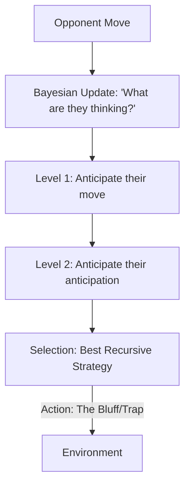

# PR2 (Probabilistic Recursive Reasoning)

🧠 **What does this do? (The Analogy)**
Think of a **Poker Game**. 
- Level 1 Player: "I have a good hand, so I will bet." 
- Level 2 Player: "I think you have a good hand, so I will fold." 
- Level 3 Player: "I think you think I have a good hand, so I will **Bluff** to make you fold." 
**PR2** is an AI that uses **Theory of Mind**. It doesn't just see "Data"—it tries to "Read the Mind" of its opponent recursively. It can anticipate bluffs, traps, and cooperation by thinking through "I think you think I think..."

🔍 **Step-by-Step Explanation:**
1. **Belief State**: The agent maintains a probability distribution over the *other* agent's policy.
2. **K-Level Reasoning**: The agent calculates its move as if the other agent is at Level $K-1$.
3. **Probabilistic Update**: Every time the opponent moves, the agent uses Bayesian math to update its "Guess" of the opponent's level of intelligence.
4. **Benefit**: It is the strongest way to solve **Competitive Games with Hidden Information**. It allows the AI to "Outsmart" opponents rather than just out-calculate them.

📊 **High-Level Design (HLD)**

✅ **Why use this?**
It is the best choice for **Adversarial Scenarios**. If you are building a security system or a trading bot that has to deal with "Smart" attackers who are trying to trick it, PR2 provides the "Mental Shield" needed to stay ahead.

🌍 **Real-World Examples:**
1. **Cybersecurity**: An AI that "thinks like a hacker" to predict where the next attack will be by recursively analyzing the hacker's likely strategy.
2. **Autonomous Negotiation**: Two AIs negotiating the price of a house, each trying to "out-reason" the other's lowest acceptable price.
