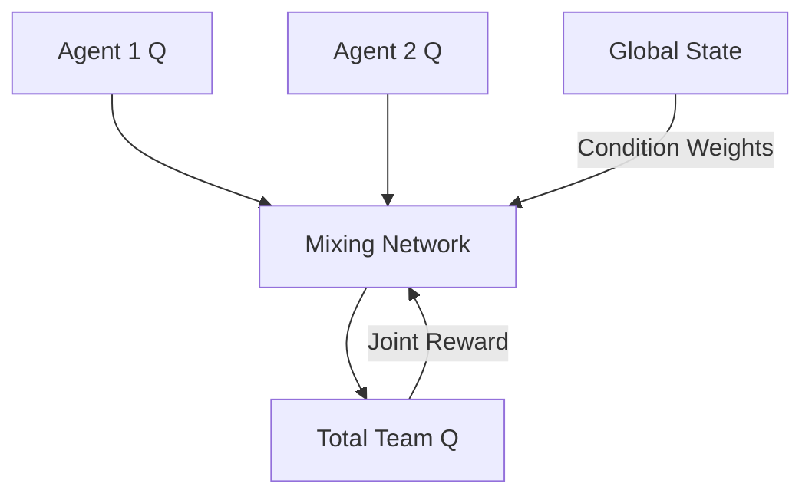

# QMIX (Multi-Agent Coordination)

🧠 **What does this do? (The Analogy)**
Think of a **Rowing Team**. If every person rows as fast as they can, the boat might just go in circles. To go straight, they need to **coordinate**. **QMIX** is like a **Coach** who looks at the "Total Speed" of the boat. The Coach ensures that if an individual rower increases their effort, the *Total* speed of the boat always stays the same or increases (**Monotonicity**). This ensures that no rower can "cheat" by doing something that helps themselves but hurts the team.

🔍 **Step-by-Step Explanation:**
1. **Local Agents**: Each agent has its own "Individual Q-value" based on its own view of the world.
2. **The Mixer Network**: A central network that takes all individual Q-values and "Mixes" them into a single **Global Q-value**.
3. **The Monotonicity Constraint**: The Mixer uses **Positive Weights**. This is the secret—it means that if an agent thinks an action is "Good" for them, the Coach must also see it as "Good" for the team.
4. **Cooperative Learning**: The team only gets a reward when they succeed together (e.g., scoring a goal).

📊 **High-Level Design (HLD)**

✅ **Why use this?**
It is the gold standard for **StarCraft II AI** and complex cooperative robotics. It allows agents to learn complex teamwork (like "I will distract the enemy while you capture the flag") without ever being explicitly told to do so.

🌍 **Real-World Examples:**
1. **Power Grid Management**: Multiple power stations working together to balance the load of a city, where each station only sees its own capacity.
2. **Automated Warehousing**: A fleet of robots coordinating to move a heavy shelf—if one robot pushes too hard, it must be balanced by the others.
