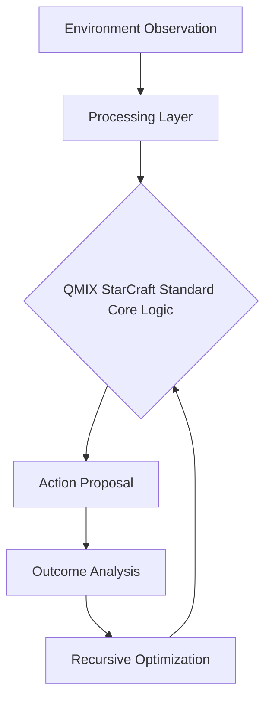

# QMIX StarCraft Standard

## 🧠 The Analogy
**A team of factory workers where each has a different skill, but the manager only looks at the 'Total Production' to decide if they are doing a good job.**

## 🚀 Overview
QMIX uses a mixing network to combine individual agent Q-values into a global value while maintaining monotonicity.

## 🔍 Key Concepts
1. **Optimization**: Maximizing long-term reward through specific architectural choices.
2. **Stability**: Ensuring the agent doesn't 'forget' or 'diverge' during training.
3. **Efficiency**: Reducing the number of samples needed to reach expert performance.

## 📊 High-Level Design (HLD)

## ⚖️ Pros and Cons
| Pros | Cons |
| :--- | :--- |
| Efficient multi-agent coordination | Assumes monotonic relationship between agents |

---
*Created for the Reinforcement Learning Encyclopedia Project.*
