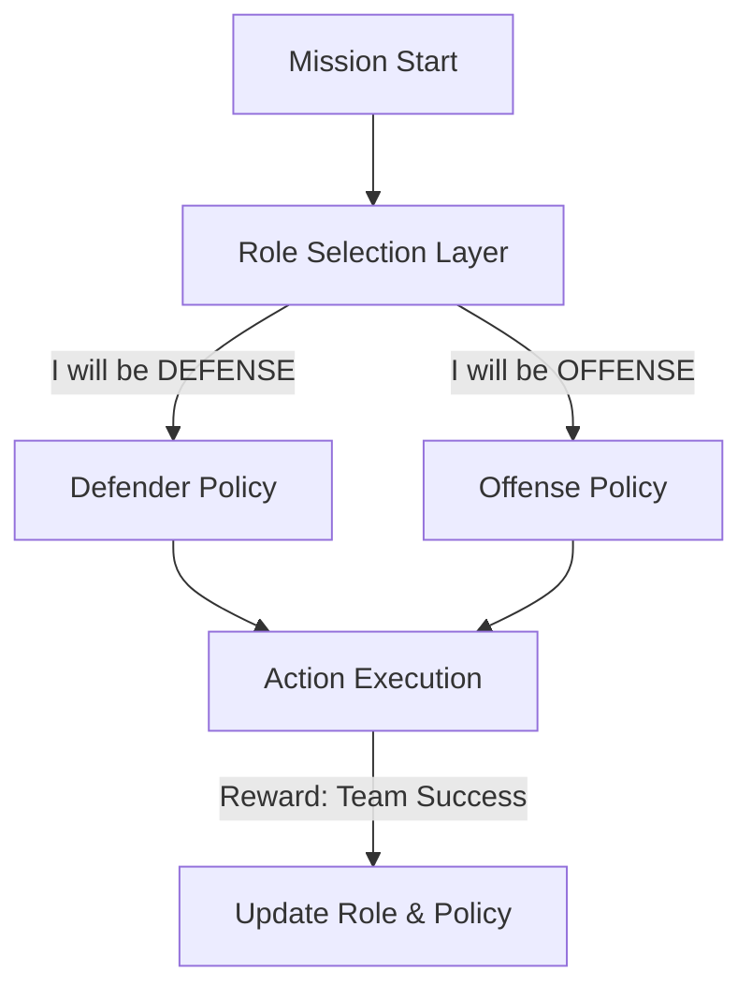

# ROM (Role-Oriented Multi-Agent)

🧠 **What does this do? (The Analogy)**
Think of an **RPG Game Party** (Warrior, Mage, Rogue). If everyone tries to be a "Warrior," the team is weak to magic. If everyone is a "Mage," the team is weak to physical attacks. **ROM** is an AI that learns to **Divide and Conquer**. It realizes that the team's reward is higher if Agent A specializes in "Defense" while Agent B specializes in "Attack." It creates a "Natural Division of Labor."

🔍 **Step-by-Step Explanation:**
1. **Role Latent Space**: The agent is trained to choose a "Role" (a mathematical hidden variable) at the start of the task.
2. **Specialized Policies**: Depending on the chosen role, the agent uses a different "Sub-Brain" or "Policy Head."
3. **Diversity Reward**: The team is rewarded if agents choose **Different** roles, preventing the "Lazy Convergence" where everyone does the same thing.
4. **Benefit**: It is much easier to manage 100 agents if they are divided into 3 groups of "Specialists" than if they are 100 individual "Generalists."

📊 **High-Level Design (HLD)**

✅ **Why use this?**
It is the best choice for **Industrial Logistics** or **Massive Games**. In a warehouse, you want some robots to "Stay near the dock" and others to "Go to the deep storage." ROM learns this organization automatically.

🌍 **Real-World Examples:**
1. **Battle Royale AI**: Coordinating 50 agents in a battle, where some learn to be "Snipers" and others learn to be "Front-line Medics."
2. **Construction Robots**: A team of robots building a house, where some learn to "Carry Bricks" and others learn to "Apply Cement."
