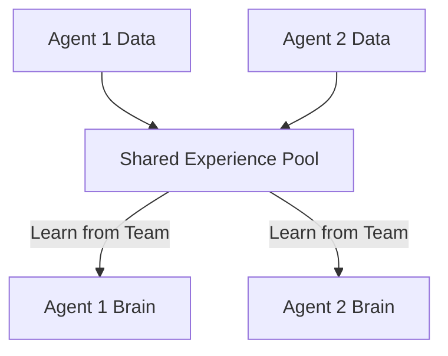

# SEAC (Shared Experience Actor-Critic)

🧠 **What does this do? (The Analogy)**
Think of a **Classroom of Students**. 
- **Standard RL**: Every student sits in a soundproof box. They take a test, see their score, and try to improve alone. 
- **SEAC**: Every student can see the test papers of **Every other student**. If Student A finds a clever trick to solve a math problem, Student B can learn from that trick **instantly**, even if Student B hasn't reached that part of the test yet. 
**SEAC** uses "Importance Sampling" to allow one agent to learn from another agent's experiences, making the whole team learn 4x-5x faster.

🔍 **Step-by-Step Explanation:**
1. **Experience Buffer**: All agents contribute their trajectories (State, Action, Reward) to a shared pool.
2. **Cross-Agent Learning**: When Agent 1 updates its brain, it doesn't just use its own data. it also picks a random trajectory from Agent 2 and says: "If I were in Agent 2's shoes, what would I have done? Would I have gotten that same high reward?"
3. **Weighting**: Because Agent 1 is different from Agent 2, we use a math trick called **Importance Sampling** to correct for the differences.
4. **Benefit**: It is incredibly efficient for "Sparse Rewards." If only one agent in the team happens to find the "Key," the whole team learns what the "Key" looks like immediately.

📊 **High-Level Design (HLD)**

✅ **Why use this?**
It is the best choice for **Heterogeneous Teams** (agents that are different). Even if one robot has wheels and another has legs, they can still learn "General Concepts" (like "Avoid the Fire") from each other's failures and successes.

🌍 **Real-World Examples:**
1. **Connected Self-Driving Cars**: If one car hits a pothole in a specific city, it shares that "Bad Experience" with every other car in the world so they all avoid it.
2. **Global Medical AI**: If a diagnostic AI in one hospital sees a rare disease, it shares the "Experience" with AIs in 1,000 other hospitals so they can all recognize it.
