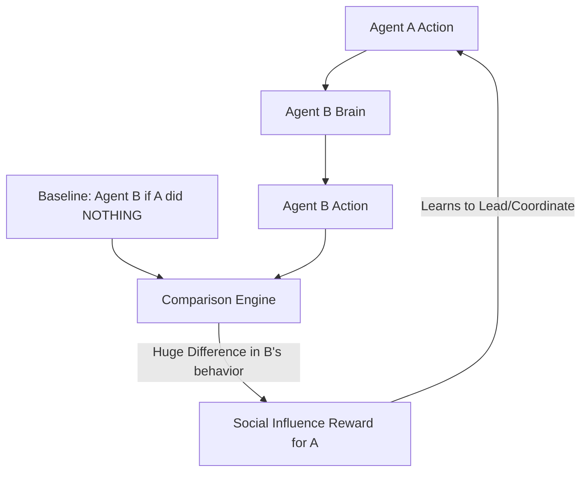

# Social Influence RL

🧠 **What does this do? (The Analogy)**
Think of a **Person pointing at a piece of cake**. 
- If they point and their friend looks at the cake, the person has **Influenced** their friend. 
- **Social Influence RL** is an AI that gets a reward whenever it manages to "Change the mind" of another AI. 
- This sounds like "Manipulation," but it actually leads to **Perfect Coordination**. Because to influence someone, you have to do something "Understandable" and "Meaningful," the agents naturally develop a **Visual Language** (like pointing or gesturing) to work together.

🔍 **Step-by-Step Explanation:**
1. **Counterfactual Prediction**: Agent A asks: "What would Agent B do if I stood here?" and "What would Agent B do if I stood there?"
2. **Difference**: If the two answers are very different, Agent A has high influence.
3. **The Reward**: Agent A is rewarded for this difference.
4. **Benefit**: It solves the "Indifference" problem in multi-agent RL where agents just ignore each other. It forces them to "Socialize."

📊 **High-Level Design (HLD)**

✅ **Why use this?**
It is the best way to develop **Spontaneous Communication**. You don't have to give the agents a "Radio" or a "Vocabulary"—they will invent their own language of "Body Movements" just to maximize their influence on each other.

🌍 **Real-World Examples:**
1. **Human-Robot Teaming**: A robot that learns to "Influence" a human to be safe (e.g., the robot blocks a dangerous path so the human is forced to walk the safe way).
2. **Traffic Coordination**: One "Smart" car influencing 10 "Dumb" cars to move into a formation that prevents a traffic jam.
