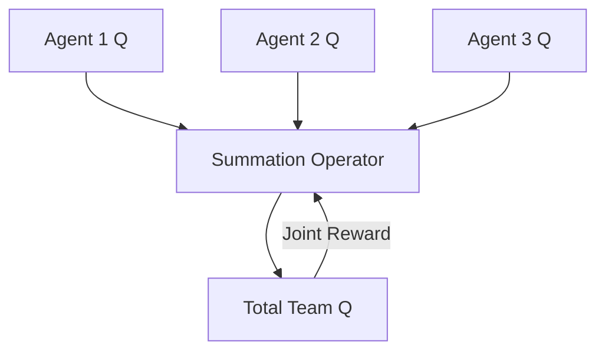

# Value Decomposition Networks (VDN)

🧠 **What does this do? (The Analogy)**
Think of a **Relay Race**. Each runner (Agent) only cares about their own leg of the race. However, the only "Score" that matters is the **Total Time** of the whole team. **VDN** is the simplest way to solve this. It assumes that the "Team Success" is simply the **Sum** of everyone's individual contributions. If Agent A works harder, the team's total score goes up by that exact amount.

🔍 **Step-by-Step Explanation:**
1. **The Decomposition**: We assume $Q_{total}(s_1, s_2, \dots) = \sum_{i} Q_i(s_i, a_i)$.
2. **Individual Training**: Even though we only get one "Team Reward," we can update every agent's brain by looking at how the total sum changed.
3. **Decentralized Execution**: During the mission, each agent just picks the action that maximizes its *own* $Q_i$. Because they were trained as a sum, their "selfish" actions naturally result in a high "team" score.
4. **Limitation**: It is very simple. It cannot handle complex "Non-linear" cooperation where two agents together are worth more than the sum of their parts (which is why QMIX was invented).

📊 **High-Level Design (HLD)**

✅ **Why use this?**
It is the perfect "Baseline" for any multi-agent project. It is incredibly easy to implement and works surprisingly well for simple coordination tasks.

🌍 **Real-World Examples:**
1. **Cleaning Robots**: A team of 5 vacuum robots—the "Team Reward" is the total area cleaned, and each robot just focuses on its own patch.
2. **Simple Logistics**: A fleet of delivery trucks where the total reward is the number of packages delivered across the city.
