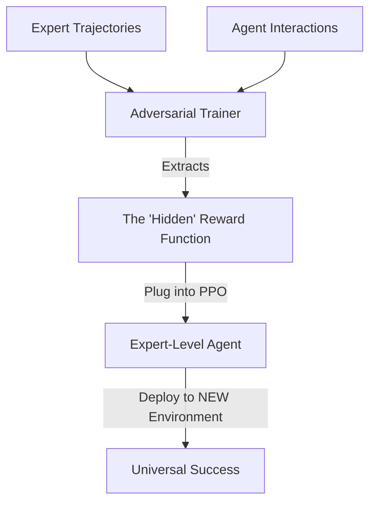

# AIRL (Adversarial Inverse Reinforcement Learning)

🧠 **What does this do? (The Analogy)**
Think of a **Student learning from a Chef**. 
- **GAIL** is like a student who just copies the chef's hand movements exactly (Mimicry). If the student is moved to a different kitchen with different tools, they fail. 
- **AIRL** is like a student who figures out the **Goal** of the chef: "They want the soup to be salty and the meat to be seared." 
- Because the student understands the **Reward** (the goal), they can cook the same soup in **any** kitchen. 
**AIRL** "extracts" the invisible reward function from human behavior, making the AI's intelligence much more flexible and portable.

🔍 **Step-by-Step Explanation:**
1. **Disentanglement**: It separates the "Goal" (Reward) from the "Movement" (Policy).
2. **Adversarial Setup**: Similar to GAIL, it uses a Discriminator to check if the AI's goals look like the Expert's goals.
3. **Reward Recovery**: It mathematically recovers a $R(s, s')$ function that can be plugged into any standard RL algorithm (like PPO).
4. **Benefit**: It is **Robust to Dynamics**. If you train a robot to walk on carpet using AIRL, it can instantly apply those "goals" to walk on ice.

📊 **High-Level Design (HLD)**

✅ **Why use this?**
It is the best choice for **Transfer Learning**. If you want an AI that learns from humans in a simulator but needs to be deployed in the messy real world where the "physics" are different, AIRL is the state-of-the-art solution.

🌍 **Real-World Examples:**
1. **Teaching Drones to Fly in Wind**: Learning the "intent" of a pilot in a calm simulator, then applying that intent to fly in a real storm.
2. **Eco-Friendly Driving**: Extracting the "Intent" of an efficient driver and using it to control 100 different types of electric cars.
3. **Personalized Medicine**: Inferring the "logic" of a top doctor's decisions and applying that logic to new patients with different genetic profiles.
