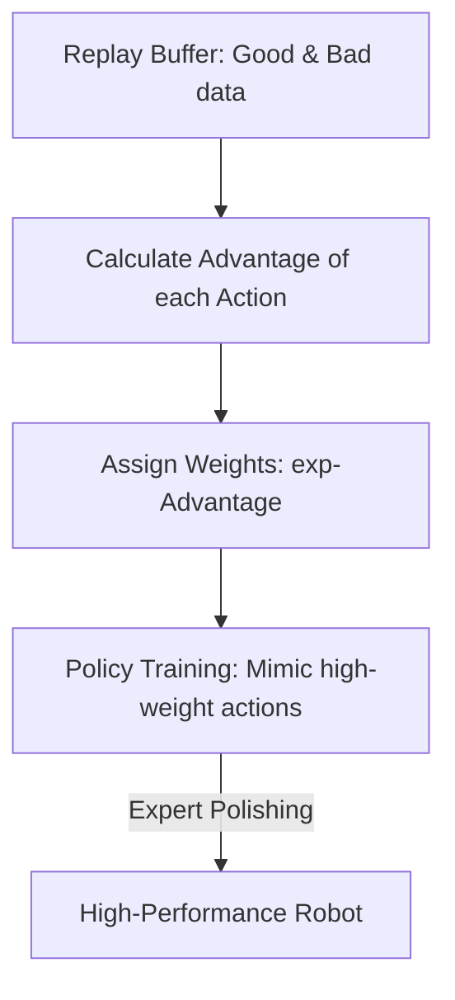

# AWAC (Advantage Weighted Actor-Critic)

🧠 **What does this do? (The Analogy)**
Think of a **Student practicing a basketball shot**. 
- They take 100 shots. Some go in (High Advantage), some miss (Low Advantage). 
- **AWAC** is the logic that tells the student: "**Memorize exactly what your arms felt like** for the 5 shots that went in, and try to forget the 95 that missed." 
It is "Weighted Memory." It treats RL like a "Memorization Game" where the AI is only allowed to memorize the "Best" moments from its past. This makes it incredibly fast at moving from "Random Play" to "Expert Performance."

🔍 **Step-by-Step Explanation:**
1. **The Advantage**: The AI calculates how much "Better" an action was compared to the average.
2. **Exponential Weighting**: Good actions are given massive weights (e.g., $100.0$), and bad actions are given tiny weights (e.g., $0.001$).
3. **Behavior Cloning**: The AI uses supervised learning to "Clone" only the high-weight actions.
4. **Benefit**: It is the best algorithm for **Online Finetuning**. You can take a robot that was trained on "Average" data and make it "Expert" in just a few minutes of real-world practice.

📊 **High-Level Design (HLD)**

✅ **Why use this?**
It is the best choice for **Bootstrapping from Data**. If you have a robot that has been "failing" at a task for 10 hours, AWAC will look through those 10 hours, find the 5 minutes where it was "almost succeeding," and turn those 5 minutes into the new master strategy.

🌍 **Real-World Examples:**
1. **Search Engine Ranking**: Learning which ads to show by "weighting" the few times a user actually clicked on an ad.
2. **Robotic Grasping**: Learning to pick up an egg by "cloning" the successful attempts and ignoring the ones where the egg broke.
3. **Smart Thermostats**: Learning to save energy by "cloning" the days where the user was comfortable and the energy bill was low.
