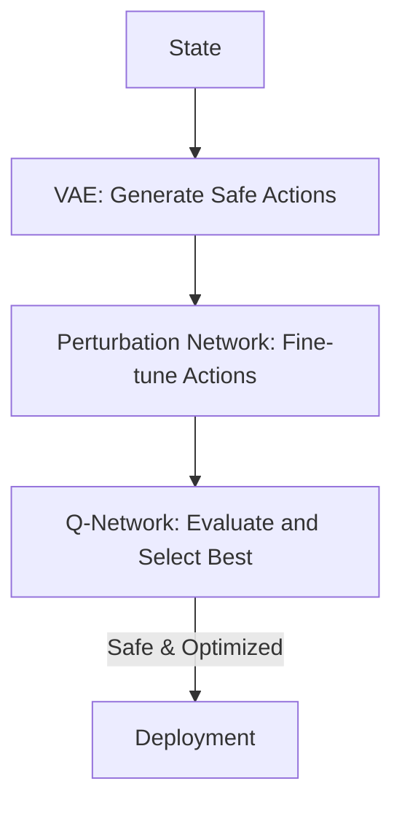

# Batch-Constrained Q-Learning (BCQ)

🧠 **What does this do? (The Analogy)**
Think of a **Cooking Recipe**. Standard RL is like a cook who tries to "invent" a new way to bake a cake by adding random chemicals. It might end in a disaster. **BCQ** is like a cook who is only allowed to use ingredients and steps that are **already in the cookbook** (the dataset). They can rearrange the steps to make a *better* cake, but they are strictly forbidden from doing anything that has never been tried before.

🔍 **Step-by-Step Explanation:**
1. **The Batch Problem**: In Offline RL, if the agent tries an action that isn't in the data, the Q-network will guess its value. This guess is almost always wrong (Optimism Bias).
2. **The Generative Model (VAE)**: BCQ trains a separate model (VAE) to learn which actions are "normal" according to the dataset.
3. **The Filter**: During training, the agent *only* considers actions that the VAE thinks are likely.
4. **The Perturbation**: Within that "safe" set of actions, the agent can make small adjustments to find a strategy that is even better than the expert who provided the data.

📊 **High-Level Design (HLD)**

✅ **Why use this?**
It was the first major algorithm to solve the "deadly triad" problem in Offline RL. It allows you to take a "boring" dataset and extract a policy that is significantly smarter than the original behavior, without the risk of the AI going "crazy."

🌍 **Real-World Examples:**
1. **Medical Treatment Plans**: Finding a better combination of existing medicines for a patient, while strictly avoiding any combination that hasn't been clinically studied.
2. **Manufacturing Efficiency**: Optimizing a factory line using old sensor logs, ensuring the robots never try a movement that could cause a mechanical failure.
