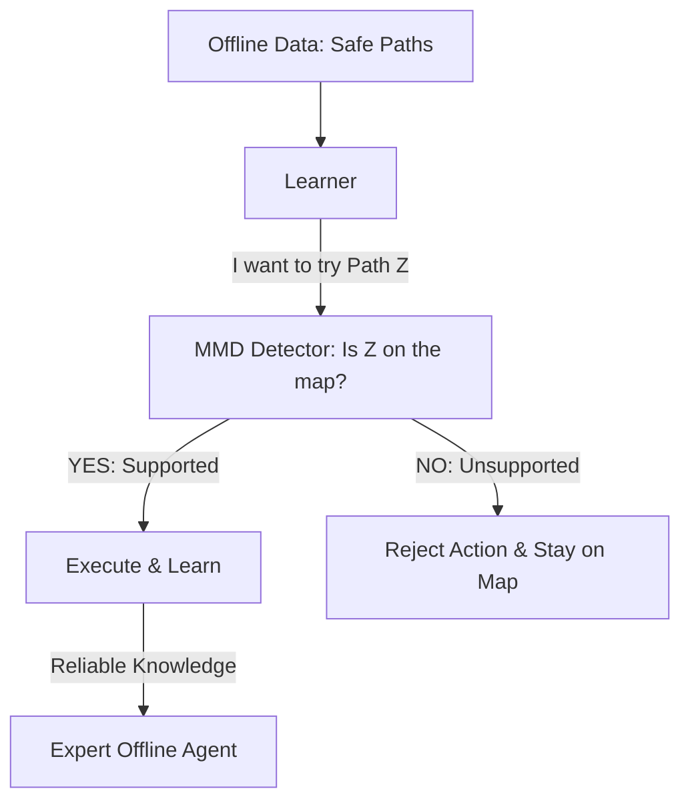

# BEAR (Bootstrapping Error Accumulation Reduction)

🧠 **What does this do? (The Analogy)**
Think of a **Person following a map through a dangerous swamp**. 
- The Map (The Offline Dataset) only shows certain safe paths. 
- A "Brave" AI might say: "I bet there is a shortcut over there where the map is empty!" (Bootstrapping Error). 
- If the AI takes that shortcut and the map is wrong, it will "fall into the swamp" and never return. 
- **BEAR** is the logic that says: "You are only allowed to move in areas where the **Map has data.**" 
It uses **MMD (Maximum Mean Discrepancy)** to measure the "Overlap" between the AI's choices and the dataset. If the AI tries to go somewhere "unsupported," BEAR pulls it back to the safe, known paths.

🔍 **Step-by-Step Explanation:**
1. **Support Constraint**: The AI is forbidden from picking any action that is "Too Different" from what is in the data.
2. **MMD Kernel**: A mathematical tool that measures the distance between two whole *distributions* of actions, rather than just two single numbers.
3. **Conservative Q-Values**: Because the AI stays within the "Support" of the data, its Q-value estimates remain accurate and don't "explode."
4. **Benefit**: It allows for **Safe Offline Learning**. It is much more stable than standard Q-learning when you can't interact with the real world.

📊 **High-Level Design (HLD)**

✅ **Why use this?**
It is the best choice for **Critical Systems with No Simulator**. If you are managing a power grid or a medical facility and you only have "Logs," BEAR ensures you find a better policy without ever suggesting an action that hasn't been "seen and verified" before.

🌍 **Real-World Examples:**
1. **Clinical Trial Design**: Optimizing the next stage of a trial by only suggesting "Safe" deviations from previous successful trials.
2. **Industrial Robots**: Learning to paint a car from 100 hours of video without ever trying a "jerky" move that could break the robot arm.
3. **Financial Hedging**: Learning to trade by only following "supported" market patterns, avoiding "Flash Crash" risks.
