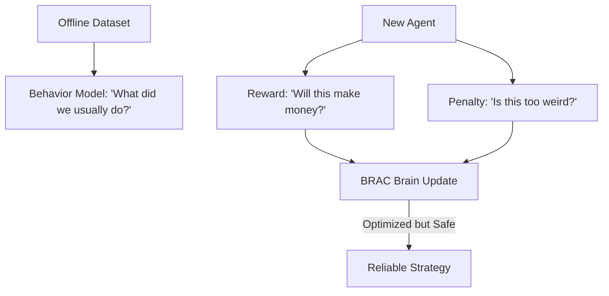

# BRAC (Behavior Regularized Actor-Critic)

🧠 **What does this do? (The Analogy)**
Think of a **Person trying to improve a company's sales by looking at last year's records**. 
- They want to suggest a new strategy (The Policy). 
- **BRAC** is like a wise CEO who says: "I want you to be creative, but **don't stray too far** from what we know works. If you suggest something completely weird that we've never tried, I will penalize your budget." 
- By keeping the "New Ideas" close to the "Old Data" (Behavior Regularization), BRAC ensures the AI never suggests a strategy that is so risky it could bankrupt the company.

🔍 **Step-by-Step Explanation:**
1. **Divergence Constraint**: It measures the distance (KL Divergence or MMD) between the AI's current policy and the dataset.
2. **Soft Constraint**: Instead of "forbidding" actions (like BEAR), it just adds a "tax" (Penalty) on actions that are too different from the data.
3. **Actor-Critic Foundation**: It uses standard SAC or TD3 but with this "Behavior Tax" added to the reward.
4. **Benefit**: It is highly **Flexible**. You can easily adjust how "Safe" or "Brave" the AI is by changing a single number ($\alpha$).

📊 **High-Level Design (HLD)**

✅ **Why use this?**
It is the best choice for **Finetuning Offline Data**. If you have a decent dataset and you want to find a strategy that is "A little bit better" without any risk of a total failure, BRAC is the most stable framework for the job.

🌍 **Real-World Examples:**
1. **Supply Chain Management**: Finding a "slightly faster" delivery route by looking at 1,000 historic trips without ever leaving the "known safe roads."
2. **Ad Bidding**: Optimizing how much to pay for an ad by looking at last month's results, ensuring the AI doesn't accidentally spend $1,000 on a single click.
3. **Patient Scheduling**: Optimizing how many patients a doctor sees by regularizing against "standard hospital practice" to ensure safety.
