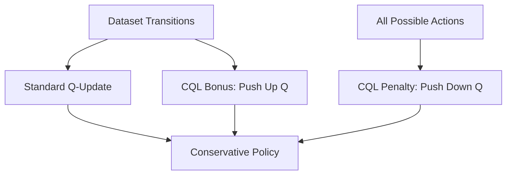

# CQL (Conservative Offline RL)

🧠 **What does this do? (The Analogy)**
Think of a **Student studying for a test** using only old exams. If the student sees a question they've never seen before, they might confidently guess a wrong answer. **CQL** is a "Reality Check." It says: "If I haven't seen this specific situation in the textbook, I should assume it's **Dangerous/Low Value** until proven otherwise." It forces the AI to be "Conservative" and only trust the actions it has actually seen work in the historical data.

🔍 **Step-by-Step Explanation:**
1. **The Offline Problem**: In Offline RL, the agent can't "try" things. If it overestimates the value of a bad action, it will get stuck in a loop of "delusional" optimism.
2. **Q-Value Suppression**: CQL adds a penalty that **Pushes Down** the Q-values of all actions.
3. **Dataset Maximization**: At the same time, it **Pushes Up** the Q-values of the actions that are actually in the expert dataset.
4. **The Balance**: The AI learns that "Known paths are good" and "Unknown paths are probably bad."

📊 **High-Level Design (HLD)**

✅ **Why use this?**
It is the industry standard for **Safety-Critical Offline RL**. If you are training an AI to manage a hospital or a nuclear reactor, you cannot let it "explore." You must use CQL to ensure it stays within the safety boundaries of the historical data.

🌍 **Real-World Examples:**
1. **Medical Treatment Recommendation**: Learning from 10 years of patient records. CQL ensures the AI doesn't suggest a "miracle cure" it has never seen, which could be deadly.
2. **Dynamic Pricing for Luxury Goods**: Learning from historical sales. CQL prevents the AI from setting a price of $0 just to see what happens.
