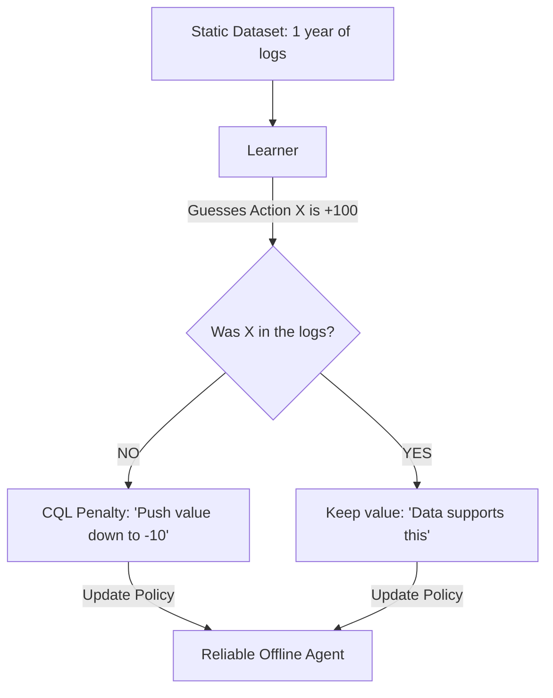

# CQL (Conservative Q-Learning)

🧠 **What does this do? (The Analogy)**
Think of a **Student studying from an old, incomplete textbook**. 
- The textbook (The Offline Dataset) says: "If you mix Chemical A and B, you get Gold." 
- The student wonders: "What if I mix Chemical A and Chemical C? The book doesn't say, so maybe I get 1,000x more Gold!" (Over-optimism). 
- **CQL** is the logic that tells the student: "If the book doesn't explicitly say it's good, **assume it's dangerous.**" 
It forces the AI to be "Conservative." It suppresses the value of any action it hasn't seen before, ensuring that the AI doesn't "hallucinate" that a random, untested move is the secret to winning.

🔍 **Step-by-Step Explanation:**
1. **Offline RL**: Learning from a static dataset without being able to "try things out" in the real world.
2. **The Problem**: Standard AI always finds a random action that it *thinks* is amazing, but it's just a mathematical error (Out-of-Distribution error).
3. **The Solution**: CQL adds a penalty to the loss function. It says: "Push the Q-values of all 'unknown' actions DOWN, and push the Q-values of 'known' actions UP."
4. **Benefit**: It is the **Safest** way to learn from data. It ensures the AI follows the data and doesn't take crazy risks.

📊 **High-Level Design (HLD)**

✅ **Why use this?**
It is the gold standard for **Offline RL**. If you have a billion rows of data from a factory or a hospital and you want to learn a better policy **without ever testing it on a real person or machine**, CQL is the algorithm you use.

🌍 **Real-World Examples:**
1. **Medical Treatment Optimization**: Learning the best way to dose medicine by looking at 10 years of patient records.
2. **E-commerce Pricing**: Setting prices by looking at historical sales data without risking a "price war" by trying random prices.
3. **Industrial HVAC**: Learning to save energy in a building by looking at sensor data from last year.
