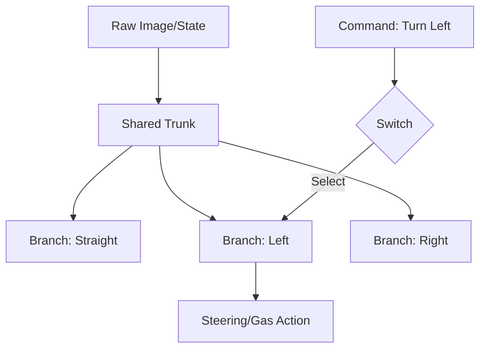

# Conditional Imitation Learning (CIL)

🧠 **What does this do? (The Analogy)**
Think of a **Student Driver and a GPS**. Standard Imitation Learning just watches the driver. But at an intersection, the driver might turn left or right. If the AI doesn't know *why* the driver turned, it gets confused. **CIL** adds a **High-Level Command** (the GPS). It learns: "If the state is an intersection AND the command is LEFT, then turn left." It removes the ambiguity of expert behavior.

🔍 **Step-by-Step Explanation:**
1. **The Branching Architecture**: The network has one "trunk" (to process the image) and several "branches" (one for each possible command).
2. **Commands**: Instead of just raw states, the agent is given a command like "Follow Lane," "Turn Left," or "Stop."
3. **Execution**: During the mission, only the branch corresponding to the current command is activated.
4. **Consistency**: This ensures that even if the expert made different choices in the same state (e.g., sometimes turning left, sometimes right), the AI understands the **intent** behind each choice.

📊 **High-Level Design (HLD)**

✅ **Why use this?**
It is the standard for **End-to-End Autonomous Driving**. It allows you to train a car to drive by watching human data, but still give it the ability to follow a specific route from a navigation system.

🌍 **Real-World Examples:**
1. **Self-Driving Taxis**: Following a passenger's route while maintaining the expert "driving style" learned from humans.
2. **Assistive Robotics**: A robot arm that mimics a human's "smooth movement" but can be told to "Grab" or "Wipe" or "Pour" at the last second.
