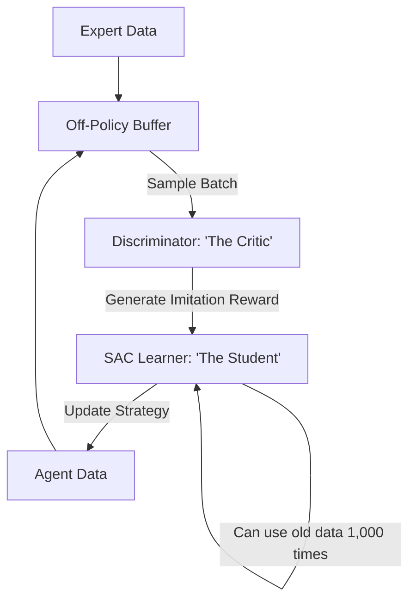

# DAC (Discriminator Actor-Critic)

🧠 **What does this do? (The Analogy)**
Think of a **Student studying for a test by looking at 1,000 old practice exams**. 
- In **GAIL** (Standard Imitation), the student has to "take the test" themselves over and over to learn. 
- In **DAC**, the student can learn by looking at **anyone's** test results (Off-policy data). 
- **DAC** is like a super-efficient grader who can look at a pile of random homework and say: "This part is very human-like, learn from it. This part is robotic, ignore it." 
Because it can use "Old" and "Random" data, it is **10x faster** and much more stable than standard imitation learning.

🔍 **Step-by-Step Explanation:**
1. **Off-Policy Buffer**: Stores all experiences (Expert and Agent) from the beginning of time.
2. **The Discriminator**: Continuously trains to tell the difference between the Expert's logs and the Agent's buffer.
3. **The Wrapper**: It "Wraps" a standard RL algorithm (like SAC) and provides a "Fake" reward signal generated by the Discriminator.
4. **Benefit**: It solves the **Biased Reward** problem. Standard GAIL fails if the robot makes a mistake early; DAC remembers the "correct" way from its long-term memory and fixes itself.

📊 **High-Level Design (HLD)**

✅ **Why use this?**
It is the best choice for **Sample-Efficient Imitation**. If you have a robot and you want it to learn from a human, DAC allows the robot to "squeeze" every last drop of intelligence out of every second of video, rather than throwing data away like GAIL does.

🌍 **Real-World Examples:**
1. **Automated Cooking Robots**: Learning to flip an omelet by watching 5 minutes of video and "practicing" in a simulator for 1 hour using DAC.
2. **Autonomous Drones**: Learning to avoid obstacles by watching a human fly through a forest once.
3. **Industrial Arms**: Learning to assemble a complex engine by using "Old logs" from previous models of the same robot.
