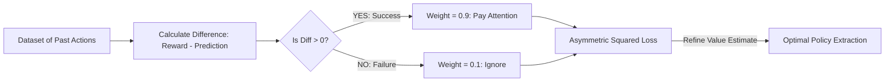

# Expectile Regression (IQL Core Math)

🧠 **What does this do? (The Analogy)**
Think of a **Teacher grading a Class**. 
- Standard regression cares about the **Average** student. 
- **Expectile Regression** is a teacher who cares more about the **Top 20%** of students. 
If a student does better than average, the teacher says: "Good! I will pay 9x more attention to you." If a student does worse than average, the teacher says: "I'll ignore you for now." By focusing only on the "Best" outcomes in a dataset, Expectile Regression allows an AI to learn the **Optimal Strategy** without ever having to try new, dangerous actions in the real world.

🔍 **Step-by-Step Explanation:**
1. **Asymmetric Loss**: It uses a squared loss $(y - \hat{y})^2$, but it multiplies the loss by a "Weight" (Tau).
2. **The Tau ($\tau$)**: 
   - If $\tau = 0.5$, it's just standard Mean Squared Error.
   - If $\tau = 0.9$, it tries to find the 90th percentile of the data.
3. **In-Sample Learning**: This is the secret to **Implicit Q-Learning (IQL)**. It allows the AI to estimate the "Maximum possible value" $(V)$ using only the data it already has, without "imagining" actions it hasn't seen.

📊 **High-Level Design (HLD)**

✅ **Why use this?**
It is the current **King of Offline RL**. Before this, Offline RL was very unstable because agents would "imagine" they were better than they really were. Expectile regression keeps the agent "Grounded" in the real data while still allowing it to pick the "Best of the Best" examples to follow.

🌍 **Real-World Examples:**
1. **Autonomous Driving from Human Video**: Looking at 1,000 hours of human driving and using expectile regression to only copy the "Smooth and Safe" 10% of movements.
2. **Robotic Surgery**: Learning the best surgical techniques by focusing on the most successful outcomes in a medical database.
