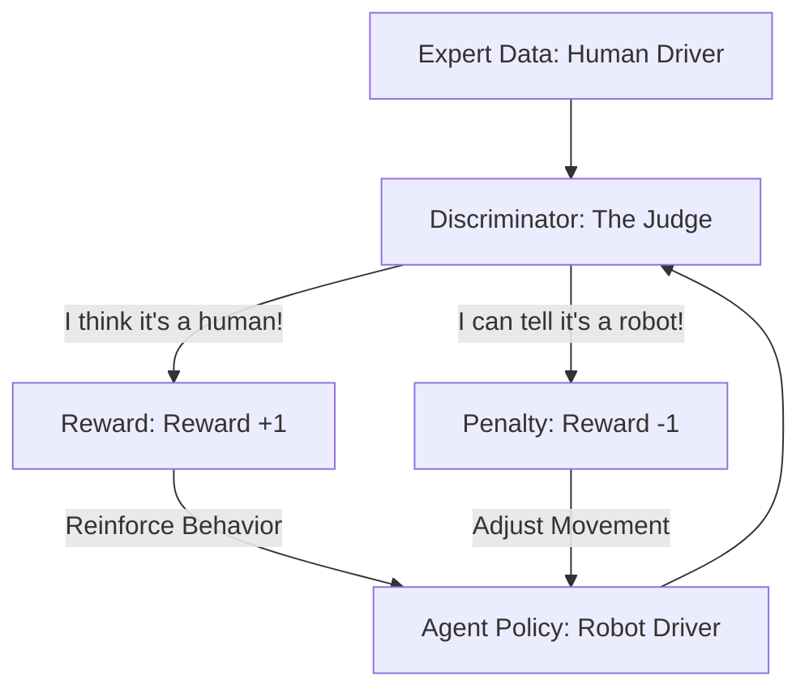

# GAIL (Generative Adversarial Imitation Learning)

🧠 **What does this do? (The Analogy)**
Think of an **Art Forger trying to copy a Van Gogh**. 
- The Forger (The AI Agent) creates paintings. 
- The Art Critic (The Discriminator) looks at the Forger's work and the real Van Goghs (The Expert Data). 
- If the Critic can tell which one is the fake, the Forger "loses" and must try harder. 
- If the Critic is fooled, the Forger "wins" a reward. 
**GAIL** allows an AI to learn how to behave exactly like a human expert without ever being told "Good Job" or "Bad Job"—it just tries to look "indistinguishable" from the professional.

🔍 **Step-by-Step Explanation:**
1. **Expert Buffer**: A recording of a human performing the task.
2. **The Discriminator**: A neural network that plays a game: "Is this movement from a human or a robot?"
3. **The Generator (Agent)**: Learns to move in a way that maximizes the "Confusion" of the Discriminator.
4. **Benefit**: It produces very smooth, human-like movements. Standard RL often looks "jerky" or "robotic," but GAIL captures the "style" and "finesse" of the expert.

📊 **High-Level Design (HLD)**

✅ **Why use this?**
It is the gold standard for **Style Transfer and Human-Robot Interaction**. If you want a robot to walk like a specific person or a car to drive "assertively" but safely like a pro, GAIL is the answer.

🌍 **Real-World Examples:**
1. **Character Animation for Games**: Training an NPC to walk, run, and fight using motion-capture data from a real actor.
2. **Autonomous Racing**: Training an AI driver to take the "racing line" by watching a professional Formula 1 driver.
3. **Medical Robotics**: A robotic surgeon learning the subtle "hand-eye coordination" of a senior surgeon.
