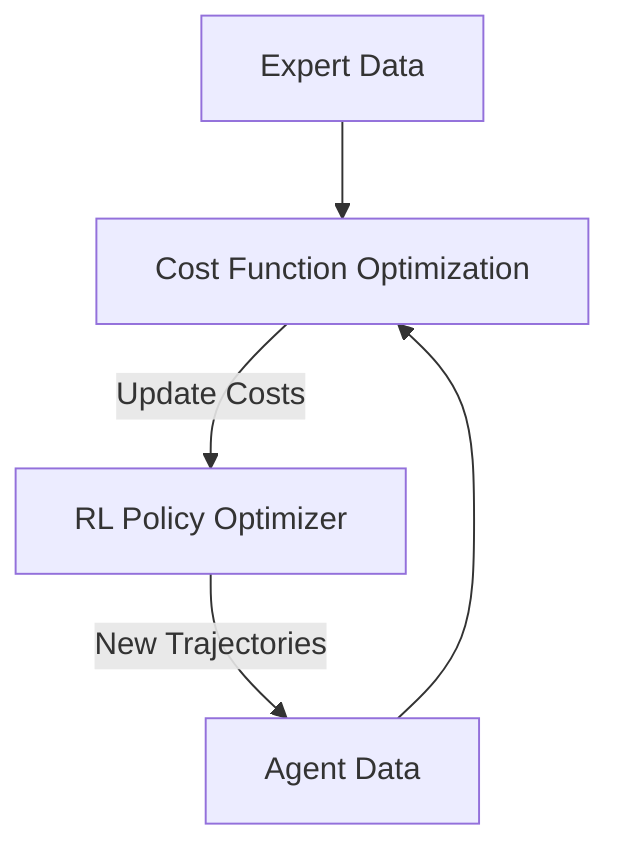

# Guided Cost Learning (GCL)

🧠 **What does this do? (The Analogy)**
Think of a **Cooking Judge**. You want to learn to cook a signature dish. You have a few examples of the final dish from a 5-star chef (**Experts**). **GCL** is like an AI that tries to invent a **Scoring System** (Cost Function). At first, it tries to find things that make the chef's dish "better" than yours. As you improve, the AI has to find even more subtle differences to score you lower. Eventually, your dish and the chef's dish get the same score because they are identical.

🔍 **Step-by-Step Explanation:**
1. **Cost Function ($C_\theta$)**: A neural network that takes a state/action and outputs a "Cost" (Penalty).
2. **The Expert**: We have data from an expert who always minimizes cost.
3. **The Agent**: An RL policy that also tries to minimize the current cost.
4. **The Update**: We update the Cost Function so that Expert trajectories have **Low Cost** and Agent trajectories have **High Cost**.
5. **The Result**: As the agent learns to avoid "High Cost" areas, it naturally starts to move exactly like the expert.

📊 **High-Level Design (HLD)**

✅ **Why use this?**
It is one of the first **Inverse RL** algorithms that can scale to complex neural networks and high-dimensional tasks (like robotics). It doesn't require a perfect simulator and can learn from limited expert data.

🌍 **Real-World Examples:**
1. **Autonomous Racing**: Learning the "perfect line" on a racetrack by watching a professional driver and recovering the cost function they use to balance speed vs. grip.
2. **Smart Manufacturing**: Learning the "cost" of different assembly movements from a master craftsman to ensure the AI robot moves with the same efficiency and safety.
