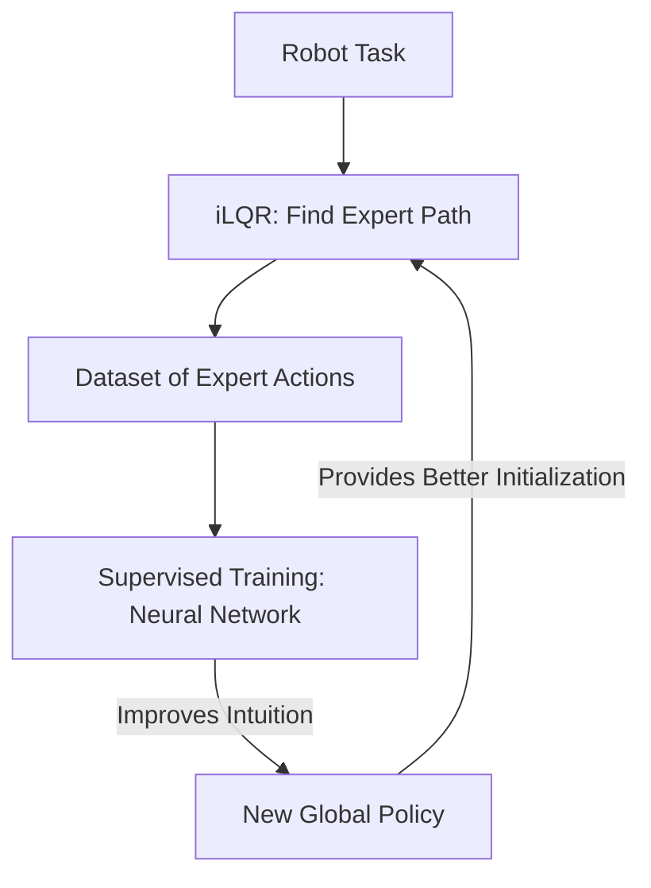

# Guided Policy Search (GPS)

🧠 **What does this do? (The Analogy)**
Think of a **Coach and a Team**. 
1. The Coach (Trajectory Optimizer like iLQR) works with one player at a time in a quiet room, finding the perfect way to move. 
2. The Team (Neural Network Policy) watches the coach and tries to **Copy (Distill)** all those perfect movements into a single, fast "Intuition." 
**GPS** is the bridge between **Math-based Optimization** and **Neural-Network Learning**. It uses high-power math to find the "Answers" and then uses Supervised Learning to "Memorize" them.

🔍 **Step-by-Step Explanation:**
1. **Local Optimization**: Use iLQR or DDP to find the perfect trajectory for a few specific starting points.
2. **Supervised Learning**: Train a global Neural Network to produce those exact same actions.
3. **KL-Divergence Constraint**: Ensure that the "Coach" and the "Team" stay close together so they don't get confused.
4. **Benefit**: It can solve complex robotics tasks (like putting a cap on a pen) that are too hard for standard RL to find through random exploration.

📊 **High-Level Design (HLD)**

✅ **Why use this?**
It is the gold standard for **Real-World Robotic Learning**. It was used to train robots to open doors, use spatulas, and assemble parts. By using "Math" as a "Guide," it avoids the need for millions of random, dangerous "trial and error" movements.

🌍 **Real-World Examples:**
1. **PR2 Robot Skills**: Learning to fold towels or screw in lightbulbs by combining local trajectory optimization with deep learning.
2. **Assembly Line Robots**: Adapting to parts that are slightly in the wrong place by learning a "General Policy" from many specific "Expert Examples."
3. **Surgical Robots**: Learning delicate movements by distilling the trajectories of master surgeons into a single AI model.
