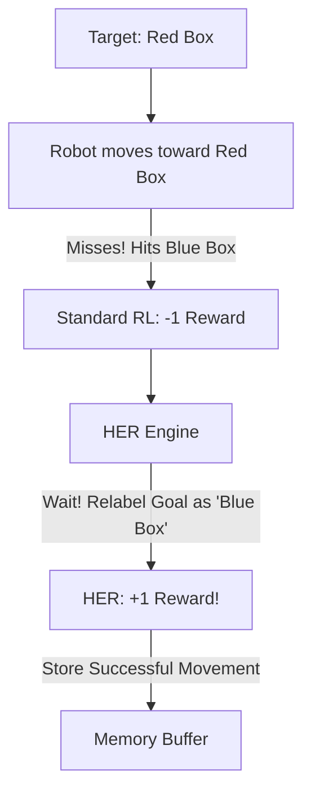

# HER (Hindsight Experience Replay)

🧠 **What does this do? (The Analogy)**
Think of a **Toddler trying to throw a ball into a bucket**. 
- They throw the ball, and it misses the bucket but lands on a **Teddy Bear**. 
- Most AI would say: "I failed. I got 0 points." 
- **HER** says: "Wait! If my goal HAD been to hit the Teddy Bear, that throw was perfect! I will remember how I did that so if I ever NEED to hit the Teddy Bear, I'm already an expert." 
By treating every failure as a "Success for a different goal," the AI learns 100x faster because every movement it makes is now a "Positive Example."

🔍 **Step-by-Step Explanation:**
1. **The Trajectory**: The agent tries to reach Goal A and fails.
2. **Goal Relabeling**: The agent looks at where it *actually* ended up (Point B).
3. **Synthetic Success**: It saves the experience in its memory as if Goal B was the target.
4. **Benefit**: In multi-goal tasks (like "Pick up any object"), this makes the data much more efficient. The AI doesn't just learn how to reach Goal A; it simultaneously learns how to reach every point it accidentally visited.

📊 **High-Level Design (HLD)**

✅ **Why use this?**
It is the "Secret Sauce" for **Robotic Manipulation**. Without HER, a robot might spend weeks trying to pick up a single block and failing every time. With HER, every "Near Miss" becomes a valuable lesson, allowing the robot to learn the physics of the block in just a few hours.

🌍 **Real-World Examples:**
1. **Robot Arm Assembly**: Learning to put a peg in a hole by "remembering" all the times the peg hit the side of the hole.
2. **Autonomous Parking**: Learning to park in *any* spot by relabeling wherever the car ended up as the "target" for that specific attempt.
