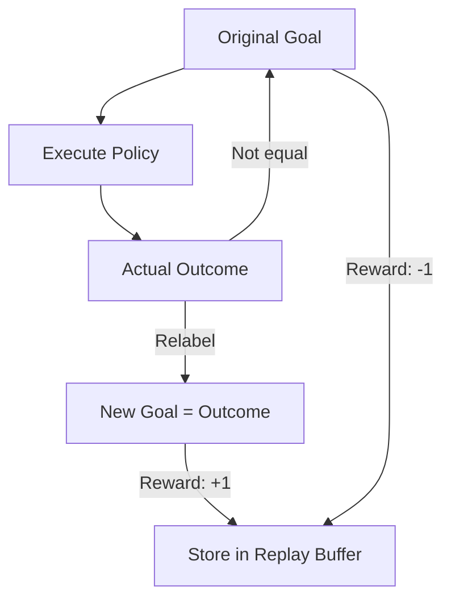

# Hindsight Experience Replay (HER)

🧠 **What does this do? (The Analogy)**
Think of a **Toddler learning to throw a ball**. The toddler tries to throw the ball into a basket but misses and hits a teddy bear instead. A standard RL agent would think: "I failed, I got 0 reward." But a **HER** agent thinks: "Wait, I didn't hit the basket, but I **perfectly** hit the teddy bear! If my goal *had been* to hit the teddy bear, I would have succeeded." The agent learns the physics of throwing from every "miss" by pretending it meant to do that.

🔍 **Step-by-Step Explanation:**
1. **Goal-Conditioned RL**: The agent takes both a State and a **Goal** as input.
2. **The Failure**: The agent tries to reach Goal A but ends up at Position B.
3. **Hindsight Relabeling**: We store the experience twice:
   - Once with the original Goal A (Result: Failure).
   - Once with **Goal B** (Result: Success!).
4. **Learning from Mistake**: The agent learns how to reach Position B, which eventually helps it understand how to reach Goal A.

📊 **High-Level Design (HLD)**

✅ **Why use this?**
It is essential for **Sparse Reward** tasks (like a robotic arm picking up a tiny screw). If the agent only gets a reward when it succeeds, it might never find the first reward in millions of tries. HER ensures it learns something from every single movement.

🌍 **Real-World Examples:**
1. **Robotic Assembly**: Learning to insert a peg into a hole even if the robot misses thousands of times.
2. **Surgical AI**: Learning to navigate internal organs where the precise target is hard to hit, but every movement provides data about the environment.
