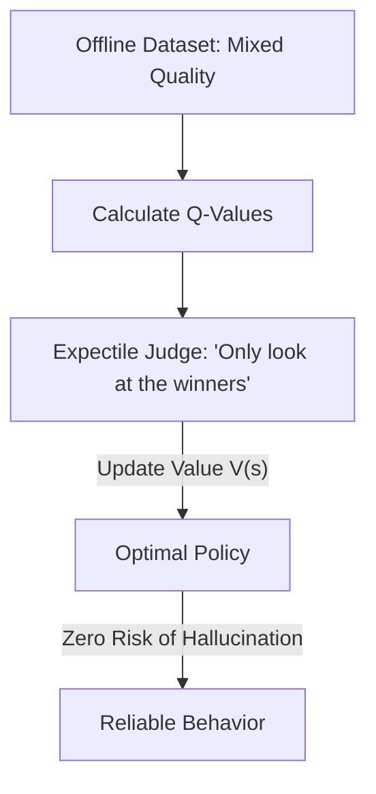

# IQL (Implicit Q-Learning)

🧠 **What does this do? (The Analogy)**
Think of a **Person watching a thousand people try to solve a Rubik's Cube**. 
- Most people fail or take a long time. 
- A few people are experts and solve it in 10 seconds. 
- **IQL** is a way for the observer to learn the "Expert moves" without ever actually touching the cube themselves. 
- It uses **Expectile Regression** to "Focus" only on the **Top 10%** of the results in the data. It basically says: "Ignore the failures, only learn from the moments where things went unusually well." 
It is the most advanced way to learn a "Perfect" policy from "Average" data.

🔍 **Step-by-Step Explanation:**
1. **The Problem**: Standard Offline RL (like CQL) is often "too scared" to try anything new.
2. **Expectiles**: IQL uses a mathematical trick called an "Expectile." It's like a mean, but it's "weighted" toward the best results.
3. **Implicit Update**: It calculates the value of a state without ever needing to guess what a "new" action would do. It only looks at the actions that are already in the dataset.
4. **Benefit**: It is **State-of-the-Art for Robotics**. It allows a robot to learn to be "Perfect" just by watching a bunch of "Average" human demonstrations.

📊 **High-Level Design (HLD)**

✅ **Why use this?**
It is the current **SOTA for Offline RL**. If you have a dataset that contains both "Good" and "Bad" examples, and you want to extract a "Perfect" agent from it without any risk of the AI "making things up," IQL is the best choice.

🌍 **Real-World Examples:**
1. **Autonomous Driving**: Learning to drive perfectly by watching 1,000 different human drivers, some of whom are bad and some of whom are good.
2. **Robotic Kitchens**: Learning to flip a pancake by watching 100 people try, and only learning from the few who didn't drop it.
3. **Dialogue Systems**: Training a chatbot to be helpful by looking at millions of conversations and "weighting" the ones where the user said "Thank you" more heavily.
