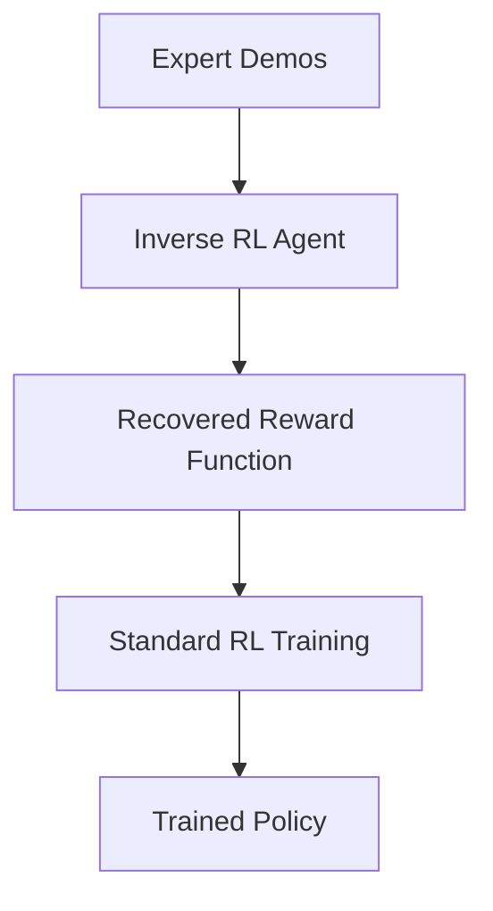

# Inverse Reinforcement Learning (IRL)

## Introduction
In standard RL, we give the agent a reward function. In **Inverse RL**, we don't have a reward function. Instead, we have **Expert Demonstrations**. The goal is to figure out what reward function the expert was trying to maximize.

## Core Concepts
- **Expert Trajectories**: Sequences of states and actions from a human/expert.
- **Reward Approximation**: Learning a function $R(s, a)$ that makes the expert's behavior look optimal.
- **Apprenticeship Learning**: Once the reward is learned, a standard RL agent is trained on it.

## High-Level Design (HLD)

## Pros and Cons
| Pros | Cons |
| :--- | :--- |
| No need to manually design rewards | Very computationally expensive |
| Good for complex tasks (Driving) | Expert might be sub-optimal |
| Captures subtle human preferences | Reward ambiguity (Many rewards fit one path) |

---

## Interview Questions
**Q: Why use IRL instead of Behavioral Cloning?**
A: Behavioral Cloning just mimics the expert's actions. IRL learns the *intent* (reward), which allows the agent to generalize better and potentially outperform the expert if it finds a more efficient path to the same goal.

**Q: What is the "Reward Ambiguity" problem?**
A: It's the fact that many different reward functions can lead to the same optimal behavior (e.g., a reward of 0 everywhere vs a reward of 10 at the goal).
