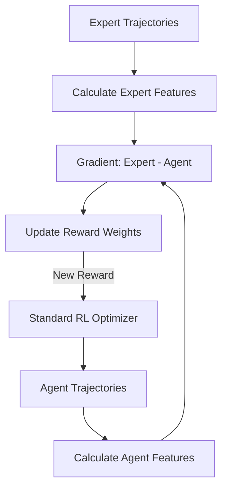

# Maximum Entropy Inverse RL (MaxEnt IRL)

🧠 **What does this do? (The Analogy)**
Think of a **Detective observing a Master Chef**. The Chef doesn't tell you the recipe (Reward Function). They just cook. The Detective watches how many times the Chef uses Salt, Butter, and Fire (**Features**). **MaxEnt IRL** is the math that allows the Detective to say: "The Chef must have a secret rule that says 'Salt is worth 10 points and Butter is worth 5 points'." It recovers the **"Hidden Values"** of the expert by trying to match their style exactly.

🔍 **Step-by-Step Explanation:**
1. **Feature Expectations**: We calculate the average features of the expert (e.g., how often they stay near the center).
2. **Maximum Entropy**: Instead of picking *one* path, the AI assumes there are many ways to be an expert. It picks the most "Random" (highest entropy) policy that still matches the expert's features.
3. **Reward Recovery**: It learns a set of weights where: $\text{Reward} = \text{Weights} \cdot \text{Features}$.
4. **Benefit**: It is much more stable than standard IRL because it doesn't "over-fit" to one specific move the expert made.

📊 **High-Level Design (HLD)**

✅ **Why use this?**
It is the standard for **Human Behavior Modeling**. If you want an AI to drive like a specific person or play a game like a professional, you use MaxEnt IRL to capture their unique "Style."

🌍 **Real-World Examples:**
1. **Personalized Driving AI**: Learning whether a specific driver prefers "Safety" over "Speed" and building a customized cruise control for them.
2. **Social Robot Navigation**: Learning the "Hidden Rules" of how humans walk in a hallway (e.g., how much space they like) to ensure the robot isn't annoying.
