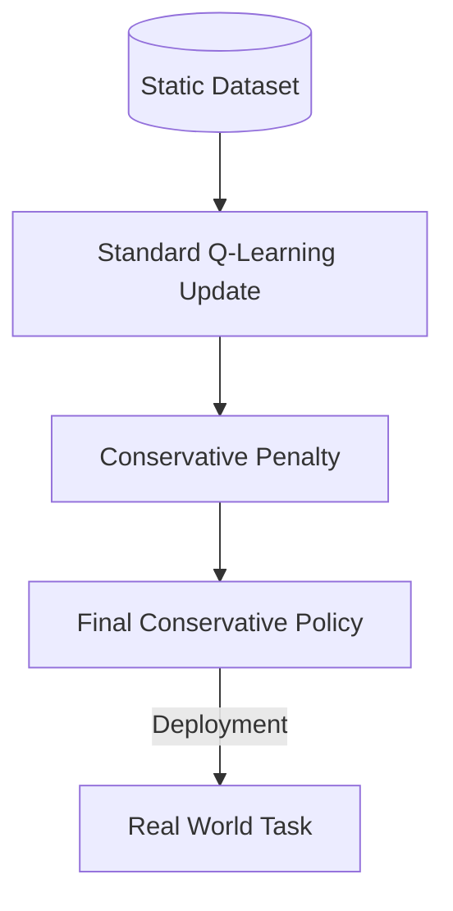

# Offline Reinforcement Learning (CQL)

🧠 **What does this do? (The Analogy)**
Think of a **Historian**. Standard RL agents need a playground where they can make mistakes. An Offline RL agent is like a historian who is locked in a library filled with **old records** of how people played a game. The agent cannot play the game itself; it must learn to become a master purely by reading the successes and failures of others.

🔍 **Step-by-Step Explanation:**
1. **The Static Dataset**:
   - The agent is given a fixed dataset of $(s, a, r, s')$.
   - No "Step" function is allowed.
2. **The "Out-of-Distribution" (OOD) Problem**:
   - Standard RL fails here because it thinks "If I do this action I've never seen, I might get +1,000,000 reward!" (Overestimation).
3. **Conservative Q-Learning (CQL)**:
   - This algorithm adds a penalty to any action that is **not** in the dataset.
   - It forces the agent to stay "conservative" and only trust the data it has.

📊 **High-Level Design (HLD)**

✅ **Why use this?**
It is perfect for fields where you **cannot afford to experiment**. You can't just "try" random treatments on patients or "try" random stock trades with billions of dollars. You must learn from historical data.

🌍 **Real-World Examples:**
1. **Healthcare**: Learning the best insulin dosage for diabetic patients using 10 years of hospital records.
2. **E-commerce**: Optimizing product recommendations using the click-history of millions of users without needing to show them "random" products.
