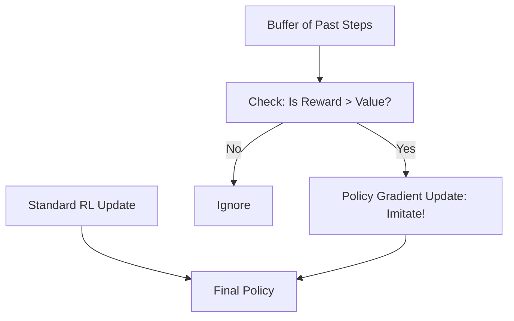

# Self-Imitation Learning (SIL)

🧠 **What does this do? (The Analogy)**
Think of an **Athlete watching their own highlights**. Standard RL is like trying to fix your mistakes. **SIL** is like saying: "Hey, I actually played perfectly 2 days ago! Let me watch that video and copy what I did then." Instead of always exploring, the agent periodically looks at its **best past performances** and forces itself to do those actions again.

🔍 **Step-by-Step Explanation:**
1. **The Best Buffer**: The agent keeps a record of its past experiences.
2. **The "Surprise" Check**: It compares a past reward ($R$) with its current estimation of that state's value ($V$).
3. **Imitation**: If $R > V$, it means the agent's past self was smarter than its current self thinks.
4. **Update**: The agent performs a "Supervised" update to make its current policy more like that successful past action.
5. **Benefit**: This is incredibly powerful for "Hard Exploration" tasks where the agent only succeeds once in a blue moon.

📊 **High-Level Design (HLD)**

✅ **Why use this?**
It fixes the "forgetting" problem. In games with sparse rewards (like Montezuma's Revenge), an agent might reach a difficult room once and then forget how it did it. SIL ensures those "breakthrough" moments are etched into the agent's brain.

🌍 **Real-World Examples:**
1. **Robotic Pathfinding**: A robot that found a shortcut through a complex warehouse once and now "imitates" itself to make that shortcut the default path.
2. **Industrial Process Control**: An AI that accidentally discovered a way to save 20% energy during a specific weather condition and now "self-imitates" that setting whenever that weather returns.
