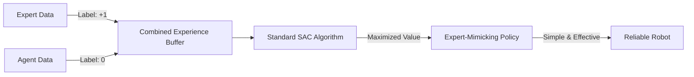

# SQIL (Soft Q-Imitation Learning)

🧠 **What does this do? (The Analogy)**
Think of a **Child learning to behave by watching their Parents**. 
- They don't have a complex "Discriminator" neural network in their head. 
- They simply assume: "Everything my parents do is Good (Reward = 1). Everything I do is just okay (Reward = 0)." 
- By trying to maximize their reward, the child naturally starts doing exactly what the parents do. 
**SQIL** is the "simplest possible" way to do imitation learning. It doesn't use GANs or complex math—it just labels expert data as "Perfect" and robot data as "Zero" and lets standard RL do the work.

🔍 **Step-by-Step Explanation:**
1. **The Hack**: Normally, RL needs a reward from the environment. SQIL "fakes" the reward.
2. **Expert = 1**: Any action found in the human's recording is given a constant reward of $+1$.
3. **Agent = 0**: Any action the robot takes on its own is given a reward of $0$.
4. **SAC Training**: Use **Soft Actor-Critic** to learn a policy that stays as close to the $+1$ rewards as possible while maintaining high entropy (exploration).
5. **Benefit**: It is **Stable**. GAIL often "crashes" because the GAN training is hard to balance. SQIL never crashes because it is just a simple classification problem.

📊 **High-Level Design (HLD)**

✅ **Why use this?**
It is the best choice for **Quick Prototyping**. If you have a small amount of human data and you want a working agent in 5 minutes without fighting with GAN hyperparameters, SQIL is the most reliable tool in the toolbox.

🌍 **Real-World Examples:**
1. **Voice Assistants**: Learning the "tone" and "rhythm" of a specific voice by labeling original clips as +1 and generated clips as 0.
2. **Simple Robotic Arms**: Learning to pick up a cup by watching 10 human demonstrations.
3. **Game Bots**: Training an AI for a mobile game by recording 1 hour of a developer playing.
