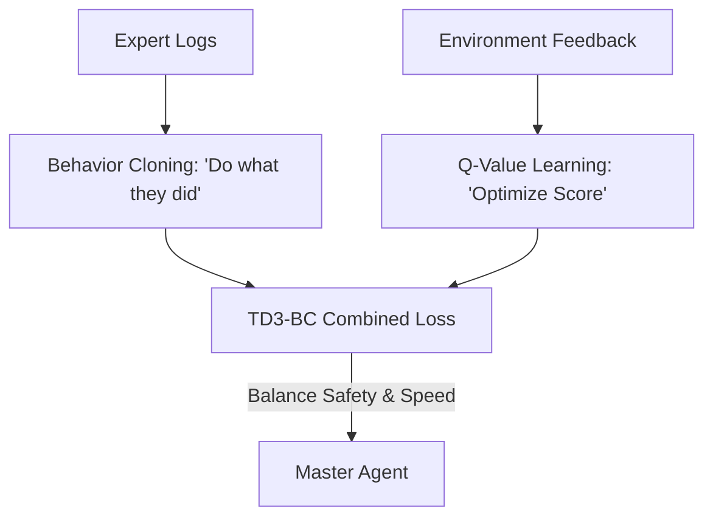

# TD3-BC (Behavior Cloning Hybrid)

🧠 **What does this do? (The Analogy)**
Think of a **Person learning to drive by watching a Video and reading a manual**. 
- The Video (Behavior Cloning) shows them what a human does: "Turn left at the light." 
- The Manual (The Q-Value) tells them the "Goal": "Don't crash, reach destination." 
- **TD3-BC** is an AI that follows both. It says: "I will do what the video shows (to be safe), but I will adjust it slightly if the manual says it will get me a higher score." 
It is the **"Sweet Spot"** between pure imitation and pure optimization. It's incredibly simple to code but beats almost all other complex "Offline RL" algorithms.

🔍 **Step-by-Step Explanation:**
1. **TD3 Foundation**: Uses Twin Delayed DDPG (the most stable "Actor-Critic" algorithm).
2. **The BC Term**: It adds a simple "Supervised Learning" penalty. If the AI deviates too far from the human expert, it gets a penalty.
3. **Action Normalization**: It scales the Q-values so they "agree" with the imitation loss, preventing one from overpowering the other.
4. **Benefit**: It is **Zero-Parameter Tuning**. It almost always "just works" out of the box for any dataset.

📊 **High-Level Design (HLD)**

✅ **Why use this?**
It is the best choice for **Industrial Prototypes**. If you have data and you want an agent that works **today**, without spending weeks tuning complex math like BEAR or CQL, TD3-BC is the industry standard for "Getting it done."

🌍 **Real-World Examples:**
1. **Automated Forklifts**: Learning to navigate a warehouse by mimicking a human driver but slightly optimizing the paths to save battery.
2. **Content Recommendation**: Mimicking a human editor's choices but adjusting which articles to show based on real user clicks (The Q-value).
3. **Smart Irrigation**: Mimicking a farmer's watering schedule but optimizing for "Lowest Water Use."
