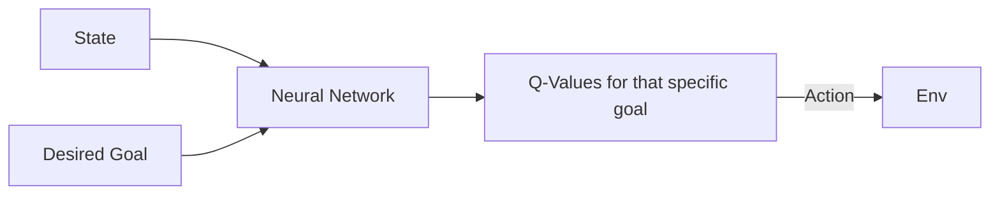

# Universal Value Function Approximators (UVFA)

🧠 **What does this do? (The Analogy)**
Think of a **Multi-Tool** (like a Swiss Army Knife). Standard RL is like a single-purpose tool: it only knows how to do one thing (e.g., "Go to the Exit"). **UVFA** is an agent that takes a **Goal** as an input. You can tell it: "Go to the Exit," or "Go to the Kitchen," or "Pick up the Red Box." Because it learns the relationship between states and *any* goal, it becomes much smarter and more flexible.

🔍 **Step-by-Step Explanation:**
1. **Goal-Conditioned Input**: The neural network takes both the State ($s$) and the Goal ($g$) as input.
2. **Generalized Learning**: When the agent learns how to reach Goal A, it also learns something about the environment that helps it reach Goal B.
3. **The Q-Function**: The Q-value is now $Q(s, a, g)$.
4. **The Benefit**: Instead of training 100 different agents for 100 different goals, you train one single agent that can generalize to any goal, even goals it has never seen before!

📊 **High-Level Design (HLD)**

✅ **Why use this?**
It is the foundation for all modern **Robotic Manipulation**. A robot in a warehouse doesn't just have one goal; it needs to be able to move to any coordinate and pick up any item on command.

🌍 **Real-World Examples:**
1. **Smart Home Assistants**: An AI that can perform any task (Turn on lights, play music, lock doors) based on the user's specific goal input.
2. **Logistics Sorting**: A robot arm that can be told to sort items into any bin, adapting its path based on the "Goal Bin" ID.
