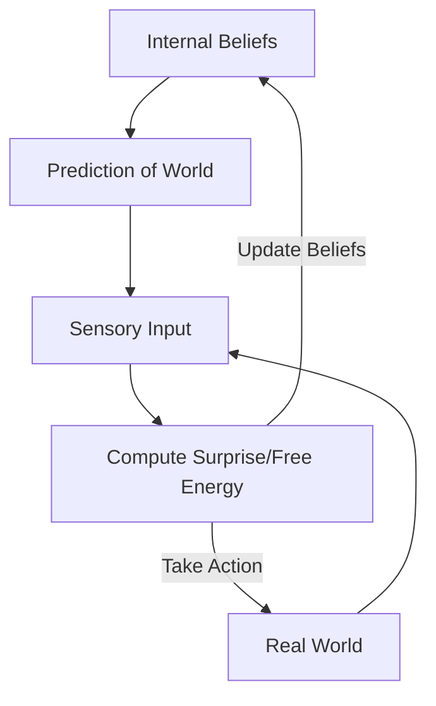

# Active Inference (Free Energy Principle)

🧠 **What does this do? (The Analogy)**
Think of your **Own Brain**. You don't necessarily hunt for "Points" in life. Instead, your brain tries to **Predict the World**. If you expect your keys to be on the table and they aren't there, you feel "Surprise" (High Free Energy). **Active Inference** says that all behavior—eating, walking, learning—is just the agent trying to **Minimize Surprise**. The agent acts to make the world match its internal model.

🔍 **Step-by-Step Explanation:**
1. **Generative Model**: The agent has an internal model of how the world should work.
2. **Variational Free Energy (VFE)**: A mathematical measure of "Surprise" (the difference between what the agent predicts and what it actually sees).
3. **Action as Inference**: The agent takes an action not to "get a reward," but to **change the world** so that its predictions become true.
4. **Epistemic Value**: The agent is naturally curious because exploring new things reduces its *future* surprise.

📊 **High-Level Design (HLD)**

✅ **Why use this?**
It is a unified theory of **Biological Intelligence**. It explains how humans learn to survive without needing an "External Score" or "Game Reward." It is extremely robust for robots in unpredictable environments.

🌍 **Real-World Examples:**
1. **Homeostasis Control**: A robot that regulates its own battery and temperature by treating "Low Battery" as a "Surprise" that it must act to fix.
2. **Adaptive Surveillance**: A camera system that learns what "Normal Traffic" looks like and only alerts a human when it sees "Surprising" behavior (like a car driving the wrong way).
