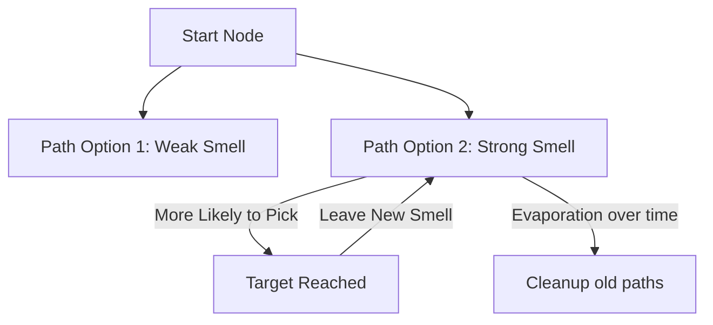

# Ant Colony Optimization (ACO-RL)

🧠 **What does this do? (The Analogy)**
Think of a **Group of Ants finding sugar**. 
1. Initially, they wander randomly. 
2. When an ant finds sugar, it carries it back to the nest and leaves a **Pheromone Trail** (a smell) on the ground. 
3. Other ants that smell the trail are likely to follow it. 
4. The more ants follow a path, the stronger the smell becomes. 
5. If a path is long, the smell **Evaporates** before it gets strong. If a path is short, the smell stays strong. 
**ACO** is an AI that solves complex routing problems by finding the "Shortest Path" through collective pheromone memory.

🔍 **Step-by-Step Explanation:**
1. **The Trail**: A mathematical "Weight" assigned to every possible connection in a graph.
2. **Probability**: The chance of choosing a path is proportional to $(\text{Pheromone}) \times (\text{Closeness})$.
3. **Pheromone Update**: Successful agents increase the weight of the paths they took.
4. **Evaporation**: Every second, all weights are decreased slightly. This prevents the AI from getting stuck on a "good" path if a "better" one is found later.

📊 **High-Level Design (HLD)**

✅ **Why use this?**
It is the best choice for **Dynamic Routing**. If you are managing a fleet of delivery trucks and one road gets blocked by traffic, ACO will naturally "evaporate" the blocked path and find a new one as the ants (trucks) explore.

🌍 **Real-World Examples:**
1. **Network Packet Routing**: Finding the fastest way to send data through the internet without a central controller.
2. **Logistics & Delivery**: A fleet of 100 trucks finding the most efficient way to deliver 5,000 packages.
