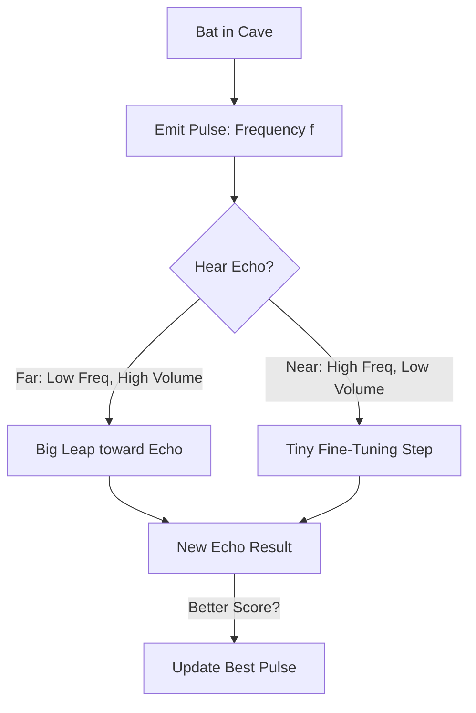

# Bat Algorithm (Echolocation)

🧠 **What does this do? (The Analogy)**
Think of a **Bat hunting for a moth in a pitch-black cave**. 
- The bat emits a **Pulse of Sound** (Echolocation). 
- If the bat is far from the moth, it pings **Slowly and Loudly** (Global Search). 
- As it gets closer to the moth, it pings **Faster and Quieter** (Local Search). 
**Bat Algorithm** is an AI that automatically switches from "Big Movements" to "Fine Adjustments" as it approaches the optimal solution. It uses the "Sound Frequency" to decide how fast to move.

🔍 **Step-by-Step Explanation:**
1. **Frequency Tuning**: Each bat has a frequency range $[f_{min}, f_{max}]$. 
2. **Pulse Emission Rate**: As the bat finds a better spot, it starts pinging more often (higher rate).
3. **Loudness Decay**: As the bat zeros in on the target, it becomes "quieter," making its movements smaller and more precise.
4. **Benefit**: It is a hybrid between **PSO** (Swarm) and **Local Search**. It has the speed of a swarm but the precision of a microscope.

📊 **High-Level Design (HLD)**

✅ **Why use this?**
It is excellent for **Signal Processing** and **Dynamic Optimization**. If you are trying to tune a radio frequency or an engine in real-time, the Bat algorithm is perfect because it "pings" the environment to see what changed.

🌍 **Real-World Examples:**
1. **Acoustic Bridge Monitoring**: Using ultrasound sensors to find cracks in a bridge by "pinging" the structure and evolving the best detection model.
2. **Scheduling in Manufacturing**: Dynamically adjusting a factory schedule by "pinging" the status of every machine.
