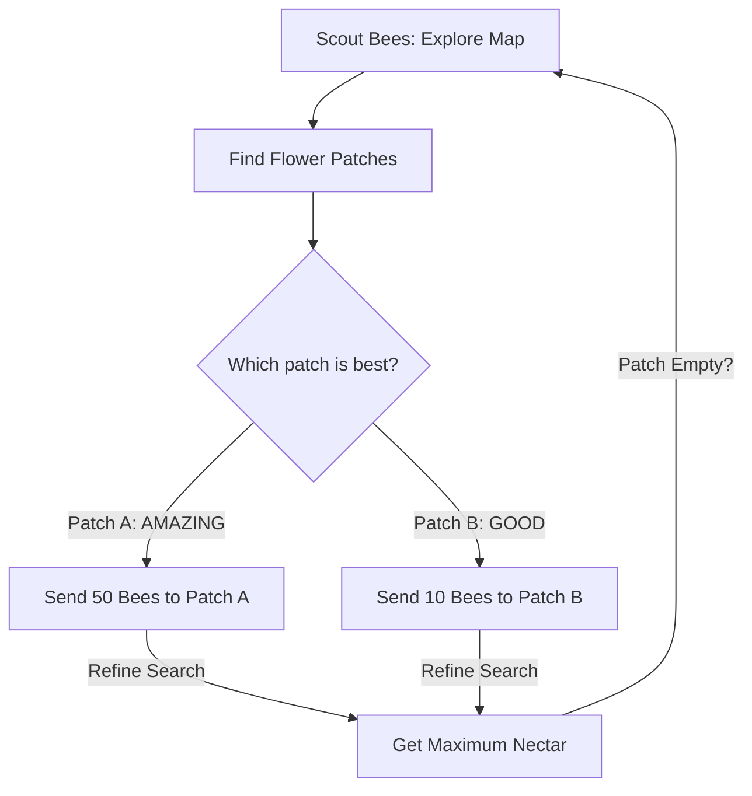

# Bee Algorithm (Foraging RL)

🧠 **What does this do? (The Analogy)**
Think of a **Honeybee Colony looking for nectar**. 
1. **Scout Bees** fly out randomly in all directions. 
2. When a scout finds a "Flower Patch" (a good solution), it returns to the hive and performs a **Waggle Dance**. 
3. The "intensity" of the dance tells other bees how good the patch is. 
4. **Recruited Bees** fly out to the best patches to gather more nectar (Local Search). 
5. If a patch runs out of nectar, the bees abandon it and go back to being scouts. 
**Bee Algorithm** is an AI that perfectly balances "Finding New Things" (Scouting) and "Exploiting the Best Things" (Foraging).

🔍 **Step-by-Step Explanation:**
1. **Scouting**: A small part of the population explores the entire map randomly.
2. **Elite Sites**: The top $N$ discovered locations are marked as "Elite."
3. **Recruitment**: More agents are sent to explore the areas *around* the elite sites.
4. **Abandonment**: If a site doesn't improve after a few tries, it is abandoned to prevent getting stuck in a local maximum.

📊 **High-Level Design (HLD)**

✅ **Why use this?**
It is one of the most **Intelligent Exploration** algorithms. It is better than PSO because it doesn't just "swarm" to one point—it maintains multiple foraging sites, ensuring it finds the absolute best "flower" in the whole field.

🌍 **Real-World Examples:**
1. **Supply Chain Management**: Finding the best suppliers by "scouting" hundreds of options and "recruiting" deeper analysis for the top candidates.
2. **Web Crawling**: An AI that "scouts" the web for information and "forages" more deeply on websites that are highly relevant.
