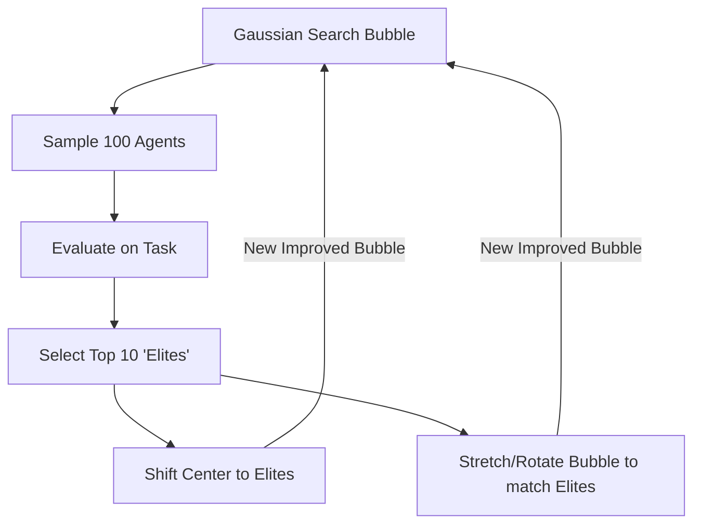

# CMA-ES (Covariance Matrix Adaptation Evolution Strategy)

🧠 **What does this do? (The Analogy)**
Think of an **Oil Prospector searching for a hidden well in a desert**. 
1. They drill 10 random holes in a wide circle. 
2. They find that the 3 holes on the **East Side** have a tiny bit of oil. 
3. **CMA-ES** is the logic they use: "Move the center of the search East, AND **Stretch the circle** into an oval that points East." 
By constantly shifting the center and "stretching" the shape of the search, it can find the exact center of the oil well much faster than random drilling.

🔍 **Step-by-Step Explanation:**
1. **The Gaussian**: The agent maintains a multidimensional "Bubble" (Gaussian distribution) of where it thinks the best parameters are.
2. **Sampling**: It generates a "Population" of random agents from that bubble.
3. **Selection**: It ranks the population and keeps the "Elite" (top 10%).
4. **Covariance Adaptation**: It looks at the elite agents and reshapes the bubble to match them. If the elite agents are all in a straight line, the bubble becomes a long "Tube."
5. **Benefit**: It is one of the most powerful "Non-Gradient" methods. It can solve problems where the reward is very jagged or noisy.

📊 **High-Level Design (HLD)**

✅ **Why use this?**
It is the gold standard for **Black-Box Optimization**. If you have a robot and you have no idea how its motors work (no math model), you use CMA-ES to "Search" for the best way to move.

🌍 **Real-World Examples:**
1. **Antenna Design**: NASA uses CMA-ES to "evolve" the shape of antennas to get the perfect radio signal.
2. **Game Balancing**: Testing a new video game by evolving AI players to find "broken" strategies or glitches.
