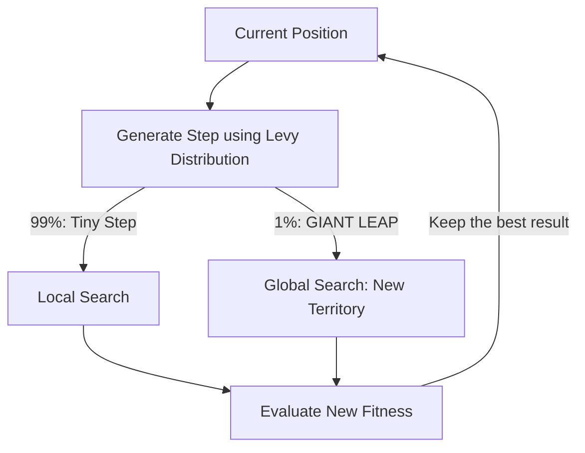

# Cuckoo Search (Levy Flights)

🧠 **What does this do? (The Analogy)**
Think of a **Bird looking for a specific tree in a continent-sized forest**. 
- Standard RL (Gaussian) is like a bird that only takes 1-foot steps. It takes millions of years to cross the forest. 
- **Cuckoo Search** uses **Levy Flights**. It's like a bird that takes 1,000 tiny 1-foot steps, and then suddenly takes one **1,000-mile LEAP** to a completely different part of the forest. 
Because the bird occasionally "teleports" to a new area, it is almost impossible for it to get stuck in a "small valley." It eventually explores every major part of the continent.

🔍 **Step-by-Step Explanation:**
1. **The Cuckoo's Egg**: Each agent (Egg) represents a possible solution.
2. **Levy Flight**: A random walk where the step size follows a "Heavy-Tailed" distribution. Most steps are small, but some are massive.
3. **Egg Replacement**: If a host bird (The Environment) finds a cuckoo egg, it throws it out and the cuckoo has to find a new "nest" (a new random starting point).
4. **Benefit**: It is the **Aggressive Explorer**. It is better than Genetic Algorithms at finding "The One Best Solution" in a massive, flat space.

📊 **High-Level Design (HLD)**

✅ **Why use this?**
It is the best choice for **Deep Exploration**. If you have a problem where 99.9% of the solutions are terrible, but 0.1% are amazing, Cuckoo Search is the only algorithm that will find that 0.1% reliably.

🌍 **Real-World Examples:**
1. **Oil & Gas Exploration**: Deciding where to drill in a massive desert by taking "Levy Leaps" across the map.
2. **Structural Engineering**: Finding the most stable bridge design among billions of possible beam configurations.
