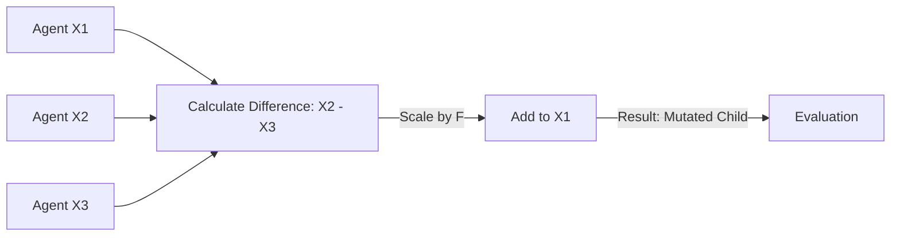

# Differential Evolution (DE-RL)

🧠 **What does this do? (The Analogy)**
Think of a **Group of Architects designing a house**. 
- Architect A has a good roof. 
- Architect B has a good garden. 
- Architect C has a terrible garden. 
- **Differential Evolution** says: "Let's take the difference between B and C (The "Goodness" of the garden) and add it to A." 
By using the **Difference** between people as a "Direction for Improvement," the architects can quickly combine the best ideas into a single perfect house. It is like a conversation where people learn from each other's gaps.

🔍 **Step-by-Step Explanation:**
1. **The Mutation**: Pick 3 random agents ($x_1, x_2, x_3$). The new "Donor" vector is $v = x_1 + F \times (x_2 - x_3)$.
2. **Crossover**: Mix the original agent's DNA with the donor's DNA.
3. **Selection**: If the new agent is better than the original, keep it. Otherwise, throw it away.
4. **Benefit**: It is incredibly **Stochastic** (random in a good way). It can jump across "Valleys" in the landscape that would stop other algorithms.

📊 **High-Level Design (HLD)**

✅ **Why use this?**
It is one of the **Most Powerful Global Optimizers** ever invented. If your reward function is "Jagged" and "Ugly" with 1,000 fake peaks, Differential Evolution will find the real peak while other algorithms get stuck.

🌍 **Real-World Examples:**
1. **Antenna Design for Spacecraft**: Finding the most efficient shape for an antenna by "differentially evolving" billions of variations.
2. **Global Supply Chain Optimization**: Calculating the best shipping routes across 50 countries simultaneously.
