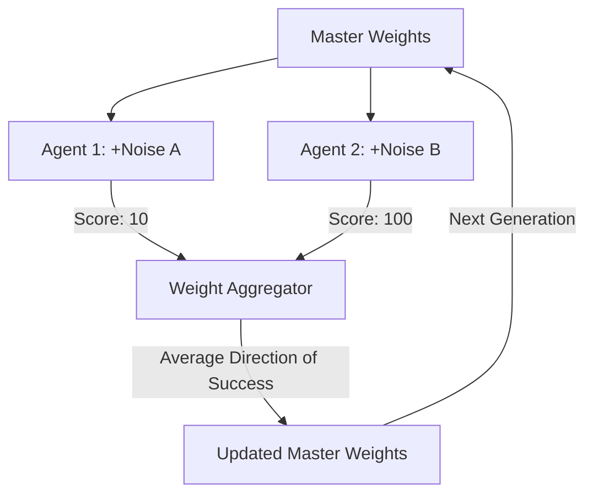

# ES Scaling (Evolution Strategies)

🧠 **What does this do? (The Analogy)**
Think of a **Person trying to find the highest point on a mountain in a thick fog**. 
- They have 1,000 friends (The Population). 
- Every friend takes a random step in a different direction. 
- Then, they all shout back their height. 
- The person doesn't move toward the friend who is highest. Instead, they move toward the **Average Direction** of all the friends who went "Up" and away from the friends who went "Down." 
Because the friends only need to shout one number (their height), this is the most **Communication-Efficient** way to train a massive AI across 10,000 computers.

🔍 **Step-by-Step Explanation:**
1. **Perturbation**: Take the master brain and add a tiny bit of random "Noise" to create 1,000 different brains.
2. **Evaluation**: Each brain plays one game. We only record the final "Score."
3. **Weight Update**: The master brain moves in the direction of the "Successes." It basically says: "If adding $+0.1$ to weight #5 resulted in a better score, then I'll permanently move weight #5 in that direction."
4. **Benefit**: It doesn't need "Gradients." It works even on things that are not differentiable (like a game that crashes randomly).

📊 **High-Level Design (HLD)**

✅ **Why use this?**
It is the best choice for **Massive Clusters**. OpenAI used this to train agents that were as good as PPO but trained in a fraction of the time because it requires **100x less communication** between computers.

🌍 **Real-World Examples:**
1. **Robotic Simulation**: Training a humanoid to walk across a thousand different types of terrain by having a thousand "virtual robots" try different styles simultaneously.
2. **Hyperparameter Search**: Using ES to find the best settings for a deep learning model by "evolving" the parameters across a large cloud cluster.
