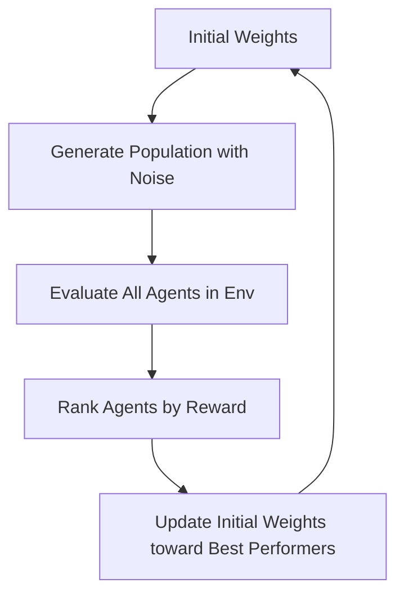

# Evolution Strategies (ES)

## Introduction
Evolution Strategies is a **black-box optimization** technique. Unlike standard RL (PPO, DQN), it doesn't use backpropagation or gradients. Instead, it "evolves" a population of agents and selects the best performers.

## Core Concepts
- **Population**: Many agents with slightly different weights.
- **Perturbation**: Adding random noise to weights.
- **Reward Weighted Sum**: Updating the main weights based on which noise resulted in higher rewards.

## High-Level Design (HLD)

## Pros and Cons
| Pros | Cons |
| :--- | :--- |
| No gradients needed (Black box) | Requires huge populations |
| Highly parallelizable | Not sample efficient |
| Robust to sparse rewards | Hard to handle very high-dim spaces |

---

## Interview Questions
**Q: How is ES different from Policy Gradient?**
A: Policy Gradient uses the environment's rewards to estimate the gradient of the policy. ES ignores gradients entirely and just looks at which "random guesses" worked best.

**Q: Why is ES good for distributed systems?**
A: You only need to communicate the rewards and noise seeds, not the entire gradient vector, making it very efficient for cluster training.
