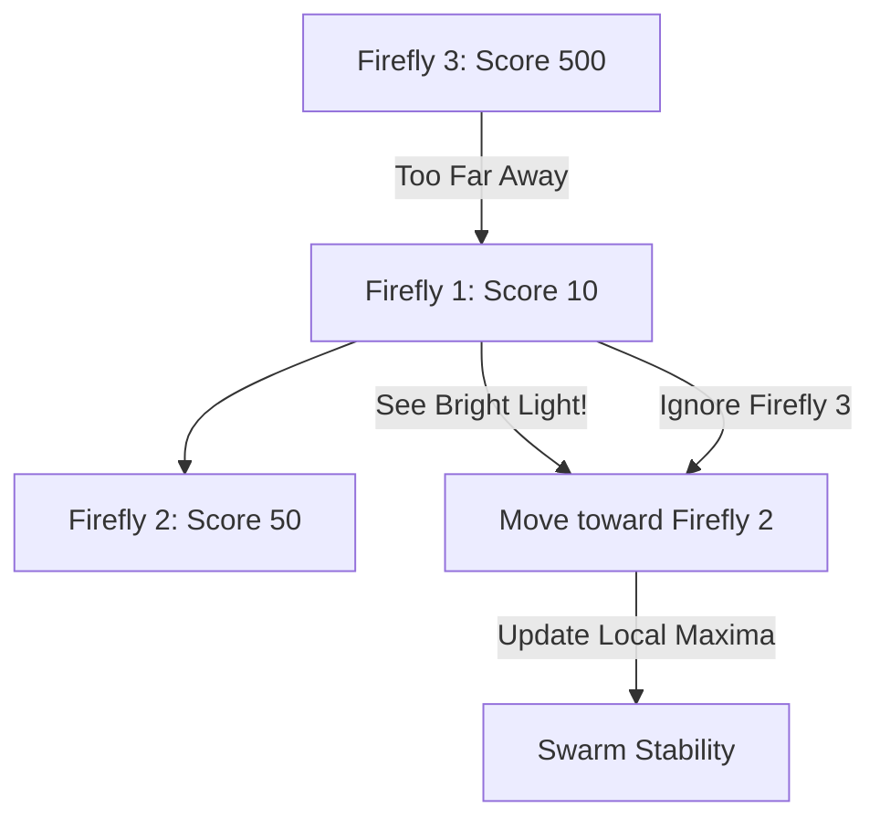

# Firefly Algorithm (Light Attraction)

🧠 **What does this do? (The Analogy)**
Think of a **Field of Fireflies at night**. 
- Every firefly glows with a certain brightness. 
- **Brightness = Fitness Score**. 
- A firefly is naturally attracted to another firefly that is **Brighter** than itself. 
- However, light gets dimmer with distance. If a bright firefly is too far away, its light is too weak to be seen. 
This creates a "Swarming" effect where groups of fireflies gather around the "Brightest" areas of the field, effectively finding all the "Peaks" in a mathematical landscape.

🔍 **Step-by-Step Explanation:**
1. **Light Intensity**: Each agent has an intensity $I$ that is proportional to its reward.
2. **Attraction**: The force pulling Agent A toward Agent B depends on $I_B$ and the distance $r$.
3. **Inverse Square Law**: Attraction $= I_0 e^{-\gamma r^2}$. This means agents only follow "Local Leaders."
4. **Benefit**: It naturally divides the population into several groups. Instead of everyone following one leader (like PSO), Fireflies find **Multiple Good Solutions** at once.

📊 **High-Level Design (HLD)**

✅ **Why use this?**
It is the best choice for **Multi-Modal Optimization**. If your problem has 5 "Good" solutions and you want the AI to find all 5 of them (instead of just one), Firefly is the algorithm you choose.

🌍 **Real-World Examples:**
1. **Cloud Computing Load Balancing**: Distributing tasks across many servers so that every server is "Bright" (busy) but not overloaded.
2. **Image Segmentation**: Grouping pixels into objects by treating "Common Colors" as bright light sources.
