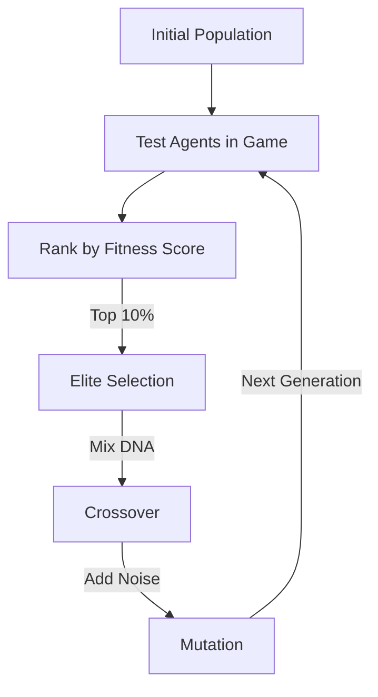

# Genetic Algorithm (GA-RL)

🧠 **What does this do? (The Analogy)**
Think of a **Breeder of Racehorses**. 
1. They have 100 horses. They race them all (Evaluation). 
2. They pick the 5 fastest horses (Elite Selection). 
3. They breed those 5 horses with each other (Crossover) to create a new generation of 100 foals. 
4. Occasionally, a foal is born with a random trait (Mutation). 
Over 100 generations, the horses become incredibly fast, even though the breeder never "taught" them how to run. They just let nature (the algorithm) do the work.

🔍 **Step-by-Step Explanation:**
1. **Population**: A group of $N$ agents with random weights.
2. **Fitness**: A score representing how well an agent performed in the game.
3. **Selection**: Picking the highest-scoring agents to be "Parents."
4. **Crossover**: Mixing the weights of two parents to create a "Child."
5. **Mutation**: Adding small random noise to the child's weights to maintain diversity.

📊 **High-Level Design (HLD)**

✅ **Why use this?**
It is the most **Universal Optimizer**. It doesn't care if the game is continuous, discrete, or has massive delays. As long as you can give it a single "Final Score," GA can solve it. It is also much less likely to get "stuck" than standard RL.

🌍 **Real-World Examples:**
1. **Satellite Orbit Optimization**: Finding the most fuel-efficient path for a satellite to stay in orbit for 10 years.
2. **Procedural Game Design**: Evolving levels or characters that are "Balanced" and "Fun" by testing thousands of variations with AI players.
